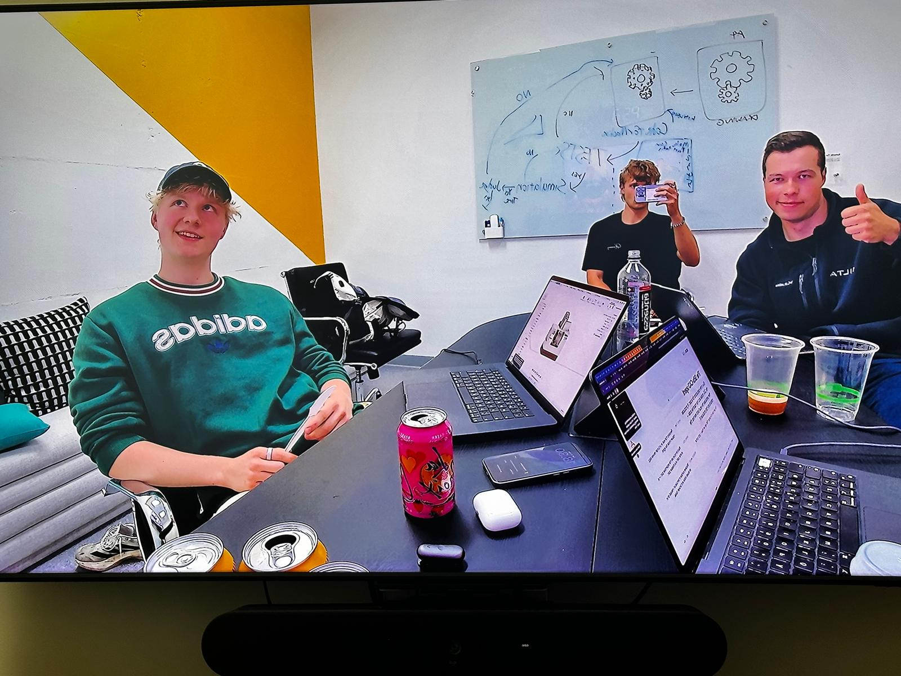
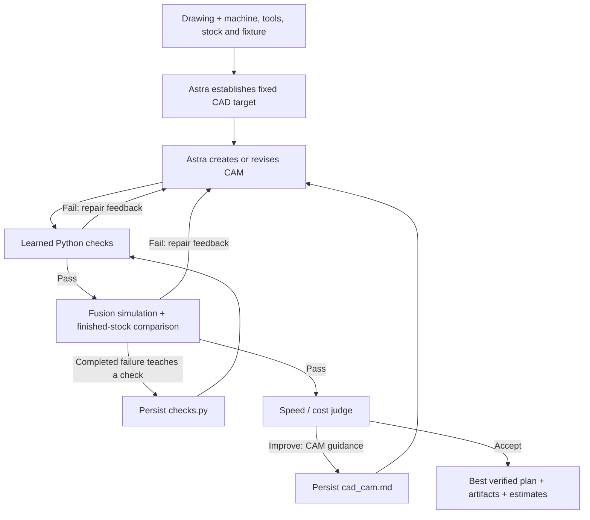

# SILTA — a CNC agent that learns from machining feedback

**Can we manufacture this new part with our equipment, and what will it take?**

SILTA helps a manufacturing shop turn a drawing into CAD, a machining plan, and an estimate of machining time and cost. It generates and repairs CAM with Astra, verifies candidates in Autodesk Fusion, and carries useful checks and planning instructions into subsequent attempts and parts.

Built by **Silta Squad** for **CoreWeave Hacks**. This is the hackathon entry point for judges, teammates, and developers, reflecting the integrated `main` branch and retained evidence on September 13, 2026.

[Pitch and recordings](demo/pitch-app/README.md) · [Evidence map](demo/pitch-app/evidence/README.md) · [W&B project](https://wandb.ai/silta/coreweave-hack-silta-squad) · [Submission draft](docs/submission.md) · [Product context](docs/project-context.md)

## The problem and business goals

A shop receives a new drawing. Before quoting or accepting the job, an estimator or CAM programmer needs to establish whether the available machine, tools, stock, and fixture can make it; choose a workable process; and estimate the effort and cost. A valid plan may still contain unnecessary travel, conservative cutting choices, or repeated mistakes that consume planning time.

SILTA's intended first use case is **new-part feasibility and machining planning for CNC shops**. Its output supports a human manufacturing decision: accepted CAD, editable CAM, posted NC, simulation evidence, and estimated timing/cost under explicit assumptions.

| Business goal | How we would measure it |
| --- | --- |
| Reduce drawing-to-plan effort | Time to a verified plan, operator interventions, and planning cost against a human or frozen-policy baseline. |
| Catch repeated mistakes earlier | First-simulation pass rate, failed simulations per completed part, and false rejections of valid plans. |
| Improve machining economics | Paired estimated machining time/cost for the same accepted part and setup, including batch size and setup assumptions. |
| Reuse shop knowledge across jobs | Frozen versus updated checks/prompts on the same unseen parts, retaining failures and completion rates. |

The commercial hypothesis is that a shop would pay for less programming effort and better supported quoting and process decisions. Pricing, willingness to pay, customer ROI, and broad transfer to unseen geometries remain to be validated. Faster estimated machining alone does not establish profitability: material, labor, setup, tooling, batch size, and the customer's price or cost target matter.

The product vision includes PDFs, drawings, and ideas expressed as text. **The current CNC CLI requires drawing artifacts and structured manufacturing configuration.** Critical dimensions and constraints must be supplied or clarified before execution.

## Team

**Silta Squad** is Konsta Varonen, Joel Jussila, and Touko Ursin. Their contribution areas are listed below. Event registration and submission status are tracked separately in the [submission draft](docs/submission.md).

| Teammate | Documented contribution area |
| --- | --- |
| **Konsta Varonen** — CTO, control.dev | Hackathon workspace and Weave starter, sponsor setup, and the early CNC product discussion/context. |
| **Joel Jussila** | Product and loop design, interactive timeline, pitch presentation, and ARIA architecture/evaluation review. |
| **Touko Ursin** | Fusion implementation and integration, CAM verification, learning evidence, campaign tooling, and recorded demos. |



## How the learning loop works



There are two per-part feedback loops:

1. **Failures teach early checks.** A failed check returns feedback for CAM repair. A completed simulation failure can generate a reusable Python check, allowing a later candidate to encounter that check before an expensive simulation.
2. **Verified plans receive improvement guidance.** The judge reviews measured estimates and may request a faster CAM plan. Every revision returns through checks and simulation. The controller retains the best verified candidate and enforces an attempt limit.

Accepted CAD and manufacturing constraints stay fixed during optimization. Passing the test gate does not replace simulation; incomplete or unknown verification is not a pass.

Exactly two files hold active learned state:

| File | What persists |
| --- | --- |
| [`learning/checks.py`](learning/checks.py) | Generated manufacturing checks derived from failures. |
| [`learning/cad_cam.md`](learning/cad_cam.md) | CAD/CAM instructions, including judge-requested planning guidance. |

Updates apply directly to later attempts and survive across parts. A new learning directory starts with basic planning instructions and no learned manufacturing checks; the repository's files already contain campaign lessons. This updates instructions and code checks, not foundation-model weights. Individual CAM optimizations need not change either file.

**ARIA's “Loop 4” is a development review:** workflow and evidence → ARIA advice → team-selected changes → implementation and validation. It is separate from the runtime judge. Completed advisory work is documented; continuous autonomous architecture changes and Weave evaluation-gated promotion remain proposals. See the [ARIA review](docs/aria-loop-review.md).

## What the hackathon demonstrates

These are retained results reported in the [submission evidence](docs/submission.md) and [pitch evidence map](demo/pitch-app/evidence/README.md), not new runs performed by this README update.

| Evidence | Recorded result | Scope |
| --- | --- | --- |
| Same-part CAM optimization, Part A | **384.860 → 211.037 seconds**, a **45.2%** reduction in estimated machining time | Fixed part, verified before and after. |
| Learned check transferred from B to C | Bad CAM rejected in **51 ms before simulation** | A specific finished-side intrusion check and retained candidate. |
| Paired Weave check replay | Empty checks caught **0/2** invalid plans; learned checks caught **2/2**; both accepted **4/4** valid plans | Six retained cases, five original executions per case/variant; not an unseen-part benchmark. |
| Stage octagonal housing optimization | **1614.397 → 1515.203 seconds**, a **6.144%** reduction | Prepared candidate plus four fresh recovery verifications; fixed CAD, no new persistent learning during this optimization. |
| Completed campaign | **13 distinct completed drawings** in the selected report; a separate completed finned rehearsal brings the gallery to 14 | Retries are not additional drawings. See the evidence map for cohort definitions. |
| Actual Fusion recordings | Octagon, cage, clevis, and selected finished-stock views | Indexed **3+2** machining; no claim of continuous simultaneous five-axis motion. |

The [final evidence bundle, v1](https://wandb.ai/silta/coreweave-hack-silta-squad/runs/cuto4ljg) is documented as published with 2,588 file entries checked against local digests. It includes campaign results, rehearsal evidence, and the final film. The [earlier v0 bundle](https://wandb.ai/silta/coreweave-hack-silta-squad/runs/43m1kgqx) is a historical six-completed-drawing snapshot. The last recorded W&B access check was private; judge access must be arranged or the portable evidence package supplied.

The **27-part animation uses scripted data**. Its 24-second playback explains the mechanism; its curves are not manufacturing measurements. A rolling average across different drawings also cannot establish causal learning because part complexity changes. Estimated machining duration is separate from simulation execution time, model latency, and total planning time.

Manufacturing results cover Fusion internal CAM simulation and bounded finished-stock comparison with the accepted target. Posted NC is an output, not separately certified by those passes. No physical machine was operated, and no physical cutting or first-article qualification is claimed.

## Run locally: choose your entry point

| Goal | Requirements | Entry point |
| --- | --- | --- |
| Watch the pitch, recordings, and learning animation | Git, Python 3, browser, internet for CDN dependencies | Static demo; no Fusion or credentials. |
| Inspect local historical jobs | Installed Python dependencies and retained run artifacts | Control center or marimo workbench. |
| Generate and verify a new machining plan | Full macOS/Fusion setup, model access, W&B credential, and a ready job configuration | CNC CLI. |

Run all commands from the repository root. Stop local servers with `Ctrl+C`.

### 1. Clone and open the browser demo

```sh
git clone https://github.com/noppud/CoreWeave-Hack-Silta-Squad.git
cd CoreWeave-Hack-Silta-Squad
python3 -m http.server 8080 --bind 127.0.0.1
```

Open the [current 11-slide pitch app](http://127.0.0.1:8080/demo/pitch-app/SILTA%20Pitch%20Deck.dc.html) or the [standalone learning timeline](http://127.0.0.1:8080/demo/). Use the deck's arrow keys/sidebar and the videos' play controls. The timeline has play/pause, stepping, and a completed-parts slider.

Curated recordings and evidence snapshots are included under `demo/pitch-app/`. React/Babel, D3, and fonts load from external CDNs, so these pages still need internet access. Keep the entire `demo` directory together when sharing. The older six-slide deck and speaking notes are maintained separately; the imported pitch app is the current presentation entry point.

### 2. Install Python dependencies

Install Git and `uv`, and use **Python 3.12 or 3.13** (`pyproject.toml` requires `>=3.12,<3.14`). The full Fusion runtime is macOS-specific.

On a Mac with Homebrew, install uv with `brew install uv`. Other installation options are in the [official uv installation guide](https://docs.astral.sh/uv/getting-started/installation/). Then install the project:

```sh
uv sync --locked
uv run python -m silta --help
```

`uv sync --locked` creates the local `.venv` and installs the pinned application and development dependencies, including the Codex SDK, Weave, marimo, and geometry libraries. `make setup` is equivalent. No JavaScript application build is required for the included demo or control-center UI.

### 3. Inspect the local workbench

```sh
uv run python -m silta.cnc.control_center --review-only
```

Open **http://127.0.0.1:8768**. Review-only mode disables job execution. To use the workbench's job launcher on the configured Fusion machine, omit `--review-only`; that launch path currently expects `~/.local/bin/hsec` and the team's `COREWEAVE_WANDB_API_KEY` secret. Use the CLI below when supplying your own exported W&B credential.

The retained marimo viewer is another way to inspect candidate timing, checks, prompt changes, STEP/CAM/NC artifacts, recordings, and Weave links:

```sh
uv run marimo run notebooks/cnc_app.py --host 127.0.0.1 --port 8791 --headless
```

Open **http://127.0.0.1:8791**. It reads `runs/demo-campaign.json` and refreshes every 15 seconds. A fresh clone has no retained `runs/` or bulk `output/` media, so historical views may be empty. The curated pitch assets are available immediately; the full evidence bundle is for inspection and does not automatically hydrate the workbench or provision Fusion.

For an optional live Fusion window and paired LAN viewer, follow [live Fusion connection](docs/live-fusion-connection.md). This requires the configured Mac and is a local-network demo service.

The [control-center guide](applications/control-center/README.md) describes its walkthrough, recorded history, and prepared demo replay. Walkthrough outcomes are illustrative even when they use archived drawings and media. The independent [`cnc_simulator/`](cnc_simulator/README.md) application has its own execution instructions and evidence; the Fusion measurements above do not describe that backend.

### 4. Prepare the full Fusion runtime

Before running a real job, establish these prerequisites:

- **Autodesk Fusion on macOS**, signed in with manufacturing access for the chosen CAM/simulation workflow. Retained integration evidence used Fusion 2705.1.15; validate compatibility on your installation.
- **The configured machine, tools, stock, fixture, and Fusion project/library access.** Local `.mch` files alone do not grant access to linked cloud machine models.
- **The local subscription-authenticated Astra runtime.** The current adapter expects `/Applications/ChatGPT.app/Contents/Resources/codex`, a ChatGPT subscription login, and access to `gpt-6-astra`. It requests low reasoning and fast service; there is no API-key or weaker-model fallback. See [`astra.py`](silta/cnc/astra.py) for the exact adapter contract.
- **Xcode command-line tools**, including `swiftc`, plus macOS Accessibility and screen-capture permissions for native Fusion evidence collection.
- **An unlocked, visible Fusion window.** Simulation collection requires foreground access. Run one Fusion worker at a time and leave its desktop available during verification.
- **A W&B API key** with access to the selected project for tracing.

Install the bridge through Fusion **Utilities → Add-ins → Scripts and Add-ins → Add-ins → +**, select this checkout's `fusion/SiltaBridge`, and click **Run**. Then check the connection:

```sh
uv run python -m silta doctor --fusion
uv run python -m silta doctor --fusion --fusion-ui
```

The first command checks subscription authentication and sends a live bridge ping. The second also reads Fusion UI evidence. Authentication does not test inference availability, and neither command proves a machining pass. See [bridge setup](fusion/README.md), [machine setup](fusion/MACHINE-SETUP.md), [fixture setup](fusion/FIXTURE-SETUP.md), and [tool setup](fusion/TOOL-SETUP.md).

### 5. Configure credentials and relocate a job

Export `WANDB_API_KEY` into the shell running the job, or inject `COREWEAVE_WANDB_API_KEY` through the team's secret manager. The CNC CLI does **not** automatically load `.env`; copying `.env.example` alone is insufficient. Its `--project` argument selects the W&B destination and defaults to `silta/coreweave-hack-silta-squad`. The starter's `WANDB_INFERENCE_MODEL` setting does not choose the CNC agent model.

Retained job JSON files contain absolute paths from the recording machine. Verify the pinned resources before producing a relocated copy:

```sh
uv run python scripts/demo/relocate_config.py config/soft-jaw-job.json \
  --old-root /Users/touko/work/helios-one/repos/coreweavehack \
  --new-root "$PWD" \
  --verify-only
```

After that succeeds, write a new configuration:

```sh
uv run python scripts/demo/relocate_config.py config/soft-jaw-job.json \
  --old-root /Users/touko/work/helios-one/repos/coreweavehack \
  --new-root "$PWD" \
  --output "$PWD/config/local-soft-jaw-job.json"
```

The destination must not already exist. Obtain missing pinned assets from their source/evidence package; do not rehash changed bytes merely to bypass validation. Relocation preserves cloud/library IDs and verifies local bytes only. If those account resources are unavailable, provision the destination machine/library and create a reviewed configuration with its actual references. Follow [configuration and relocation](config/README.md#relocating-a-checkout) for the complete process.

The job must be `ready`, with no unresolved inputs, and specify drawings, machine, tools, setup, tolerances, and relevant cost assumptions. Keep local path/account changes out of shared example configurations.

### 6. Run a machining job

With `WANDB_API_KEY` already exported and the relocated setup validated:

```sh
uv run python -m silta init
uv run python -m silta run config/local-soft-jaw-job.json \
  --project YOUR_ENTITY/YOUR_PROJECT \
  --learning-directory learning \
  --max-attempts 20
```

Replace `YOUR_ENTITY/YOUR_PROJECT` with a W&B project you can write to. On the team's configured machine, secret injection can instead wrap the run command:

```sh
hsec exec --only COREWEAVE_WANDB_API_KEY -- \
  uv run python -m silta run config/local-soft-jaw-job.json
```

`init` creates either learning file only if it is missing; it does not reset campaign lessons. Reusing `learning/` allows subsequent parts to inherit updates. To start without learned checks, pass a new directory such as `--learning-directory .private/learning-fresh`; it will be initialized automatically.

Each job writes attempts, artifacts, verification evidence, and a Weave receipt under `runs/<job-id>/`. Use `--job-id` for an explicit new identifier and `--runs` to change the output root. The attempt cap is an execution limit, not a success verdict. Inspect the final result and its best verified candidate.

Fusion APIs handle setup, toolpath generation, timing, and postprocessing. A fixed native runner collects simulation and stock evidence; routine collection does not require Astra clicking. Generated checks run in a bounded local Python subprocess, which is **not a security sandbox**. The live loop has no hosted W&B Sandbox or Docker requirement, and sends no commands to physical machinery.

## Architecture and sponsor use

| Component | Role in this build |
| --- | --- |
| Astra through the local Codex SDK | Establish CAD, create/repair CAM, propose checks, and judge improvement opportunities. |
| Autodesk Fusion + SiltaBridge | Execute CAD/CAM operations, generate toolpaths and posted NC, and provide machining estimates. |
| Fixed verifier + geometry comparison | Collect completed simulation evidence and compare finished stock with the accepted target. |
| W&B Weave | Trace application stages and learning changes; publish retained-case check comparisons and deterministic post-run outcome scores. Evaluations do not gate live learning updates. |
| ARIA | Review source and actual traces, advise on architecture/evaluations, and inform a tested Fusion session-readiness repair. ARIA's recorded review model is separate from project agent roles. |
| marimo | Inspect retained runs, measurements, artifacts, learning changes, video, and trace links in a read-only notebook. |

See [sponsor evidence](docs/sponsor-evidence.md), [evaluation scope](docs/demo-evaluation.md), and [Weave dashboard evidence](docs/weave-evaluation-dashboard.md). Existing evaluation/version infrastructure remains in source; its presence does not make promotion gating or native Agents Signals an active default.

## Development and troubleshooting

```sh
# Required repository checks: lint, formatting, and Python tests
make check

# Standalone presentation checks; requires Node.js 20+
node demo/check-demo.cjs
```

Software tests use adapters and fixtures and do not establish manufacturing readiness. On the original evidence machine, `uv run python scripts/demo/verify_demo.py` validates the retained campaign and generates `output/demo-readiness.json`; it is not a fresh-clone smoke test.

| Symptom | What to check |
| --- | --- |
| Python module missing | Run `uv sync --locked` from this checkout and use `uv run`. |
| W&B credential missing | Export the key or inject it; `.env` is not loaded by the CNC CLI. Set `--project` for your account. |
| Codex binary/login missing | Check the adapter's expected local binary and subscription authentication before using `doctor`. |
| Missing artifact or hash mismatch | Run relocation verification and obtain the exact pinned resources. See `config/README.md`. |
| Fusion add-in timeout | Start SiltaBridge and ping it. Inspect its processing/response queue before retrying a timed-out mutation; see [queue recovery](docs/queue-recovery.md). |
| Simulation collection unknown | Check foreground Fusion, native permissions, document identity, and evidence. Unknown cannot be promoted to a pass. |
| Empty historical viewer | Restore the retained local run/media artifacts, or use the included pitch recordings. |
| Pitch does not load | Serve it over HTTP and check internet access to the external runtimes/fonts. |

## Repository guide

| Path | Contents |
| --- | --- |
| [`silta/cnc/`](silta/cnc/) | CLI, controller, Astra roles, checks, verifier, tracing, and workbench servers. |
| [`fusion/`](fusion/) | SiltaBridge add-in and machine/tool/fixture integration guides. |
| [`config/`](config/) | Job examples and pinned manufacturing resources. |
| [`learning/`](learning/) | The two active shared learning files. |
| [`applications/control-center/`](applications/control-center/) | Local Fusion workbench frontend and packaged viewer dependencies. |
| [`cnc_simulator/`](cnc_simulator/README.md) | Independent simulator application with its own runtime and evidence. |
| [`notebooks/cnc_app.py`](notebooks/cnc_app.py) | Retained-run marimo viewer. |
| [`demo/`](demo/) | Scripted timeline, decks, curated recordings, and portable pitch evidence. |
| [`scripts/demo/`](scripts/demo/) | Relocation, campaign, rehearsal, evidence packaging, and verification tools. |
| [`tests/`](tests/) | Software regression tests. |
| [`docs/project-context.md`](docs/project-context.md) | Product intent, loop decisions, metric definitions, and agent handoff. |
| [`docs/implementation-plan.md`](docs/implementation-plan.md) | Implementation checkpoints; newer evidence supersedes earlier status. |

`runs/`, bulk `output/`, `.private/`, and local credentials are ignored artifacts, not a complete part of a fresh clone. Read [AGENTS.md](AGENTS.md) and the project context before changing the loops, demo, metrics, or pitch.

## Hackathon handoff and next steps

Start judges with the current pitch app, show one measured optimization and one learned-check transfer, then open the evidence map or a real Weave trace. The [demo runbook](docs/demo-runbook.md) contains the prepared Fusion presentation flow. Identify prepared CAD/CAM, retained playback, and fresh verification as such.

On the machine with retained campaign artifacts, create a portable evidence package with:

```sh
uv run python scripts/demo/package_evidence.py
```

Open the generated `output/submission/silta-fusion-evidence-*/index.html` or share its ZIP. Packaging is local; the command does not upload it or submit the hackathon entry.

The [submission draft](docs/submission.md) records final evidence publication and remaining event-delivery work; it does not record a completed event submission. It distinguishes project work from existing Fusion, Codex, Weave/ARIA, marimo, geometry libraries, and imported manufacturing assets. The [hackathon brief](docs/hackathon.md) contains historical handbook notes; use the organizer's current instructions for deadlines, track selection, and stage limits.

Next product and engineering goals are to validate shop economics with real users, measure old/new policies on held-out parts, scope lessons to applicable machines and fixtures, and add evaluated promotion/rollback before expanding shared learning. Production qualification and physical machining validation remain separate work.
