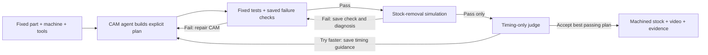

# The agreed loop, implemented

The agreed Mermaid source is `docs/loop.md` on `origin/main`, commit `38136d1`, preserved in `references/agreed-loop.md`. This implementation follows its CAM/check/simulation/repair and judge/playbook routes, displayed using Joel's `1b1980d` two-loop presentation. Touko's later time-only and boolean-verdict instructions supersede the older cost language. The check-generation branch is bounded to validated exact-failure predicates; arbitrary model-written executable checks are not supported.

- `camloop/indexed/runner.py` executes these routes. A failed reference also enters repair.
- `learning.py` saves an exact failed-geometry predicate, keyed by fixed job, geometry-affecting strategy and compiler/verifier source hashes. Feed-only repeats can be screened before simulation. It cannot reject a different configuration or establish a pass.
- Transferable failure observations remain advisory. CAM may now request `junction_cleanup`; this compiles smaller-tool cuts in a pocket union instead of assuming independently cleared features cover the junction.
- `feedback-memory.json` is written on each simulation failure and each judge rejection, before the next CAM request. Both check and speed memories carry into the next part's versioned memory file.
- The judge receives only time, breakdown, valid-time history and remaining budget. It neither designs geometry nor proposes operations or simulator actions.
- Every changed geometry plan still gets full simulation. The immutable target and tolerance are never repaired to match a bad cut. There is no third pass/fail decision.
- Replay speed is presentation-only. Loop events, timings, failures and memories come from saved executions. Different parts' absolute cycle times are not plotted as a learning gain.

Joel's original standalone presentation is preserved in `references/joel-demo/`, from commit `1b1980d23bcdefdf3986363d6055b84327f4dbac`. It contains 54 scripted inputs and is not evidence of a real run. The new `loop.html` uses the same two feedback routes with measured local evidence and actual machining playback.
