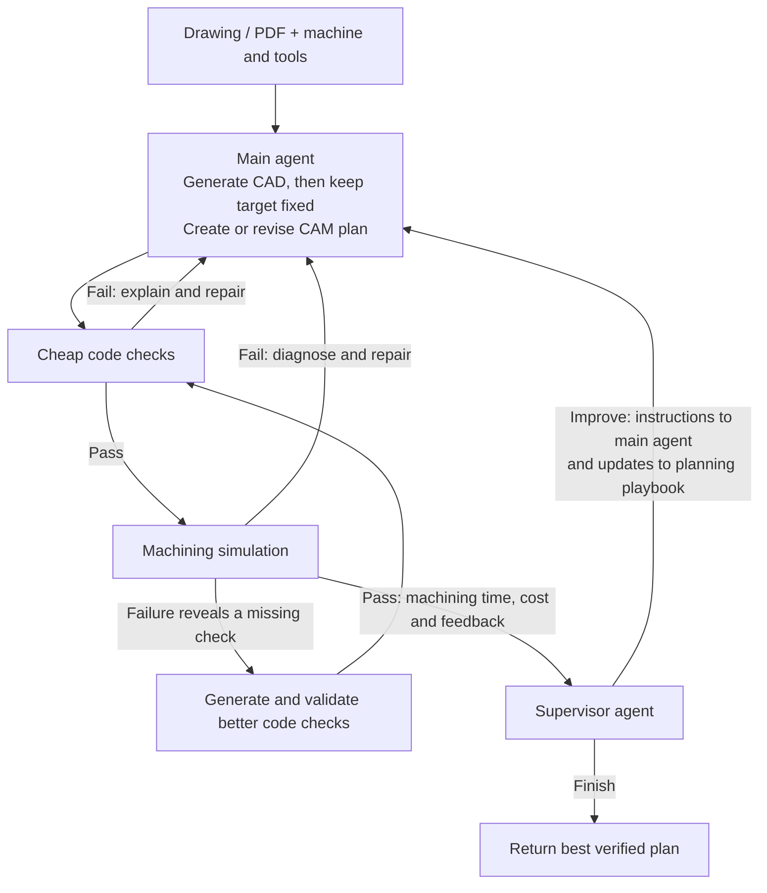

```mermaid
flowchart TD
    A["Drawing / PDF + machine and tools"] --> B["Main agent<br/>Generate CAD, then keep target fixed<br/>Create or revise CAM plan"]
    B --> C["Cheap code checks"]
    C -->|"Fail: explain and repair"| B
    C -->|"Pass"| D["Machining simulation"]

    D -->|"Fail: diagnose and repair"| B
    D -->|"Failure reveals a missing check"| E["Generate and validate better code checks"]
    E --> C

    D -->|"Pass: machining time, cost and feedback"| F["Supervisor agent"]
    F -->|"Improve: instructions to main agent<br/>and updates to planning playbook"| B
    F -->|"Finish"| G["Return best verified plan"]
```
