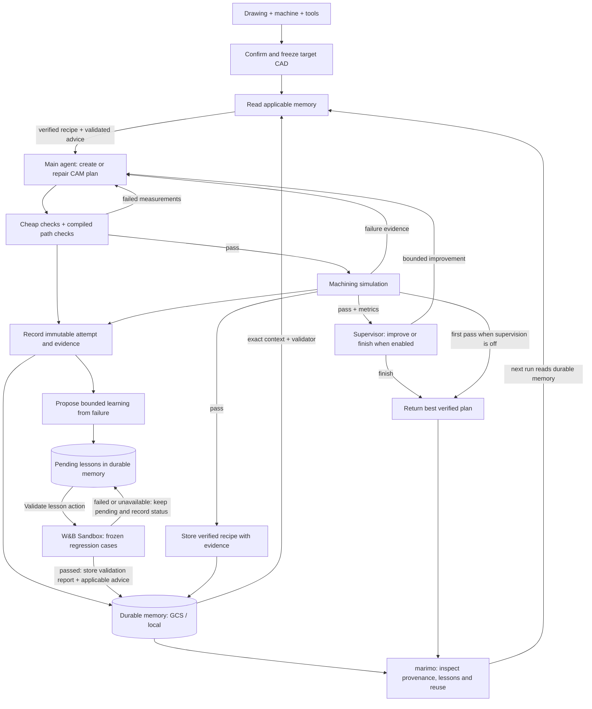

# Silta CNC — technical architecture

Status: proposed contracts, September 12, 2026. These interfaces are to implement; defaults and numerical thresholds are demonstration assumptions to validate, not current functionality.

## 1. System



One marimo server, one session controller per browser session, a storage adapter (local for development, Cloud Storage for live artifacts), and bounded workers for CAD/simulation. Deploy the complete application to GCP Cloud Run. No separate database server, Redis, Kubernetes, general agent bus or REST service for the MVP. Keep the application service independent of marimo for future clients.

Candidate direct dependencies: `marimo`, `pydantic`, `cadquery`, `numpy`, `wandb`, `weave`, `httpx`, `anywidget`, `traitlets`, and a PDF renderer if PDF ships. Pin resolved versions in `uv.lock`; prove CAD/kernel/Python compatibility with a smoke test. Keep existing Python 3.12 unless the test requires a change. Bundle pinned Three.js assets and licenses locally; do not depend on a CDN during judging.

CadQuery supports STEP import/export and mesh export; STEP does not preserve the original parametric program. Keep the spec and builder version as editable source of truth. [CadQuery import/export](https://cadquery.readthedocs.io/en/latest/importexport.html).

## 2. Files and ownership

```text
notebooks/workbench.py          Chat, uploads, confirmations, attempts, viewer
notebooks/evaluations.py        Dataset/policy comparison and sponsor evidence
silta/domain.py                Versioned contracts, enums, units
silta/service.py               UI-independent typed application interface
silta/controller.py            State machine, budgets, cancellation
silta/providers.py             W&B/OpenRouter adapters, capabilities
silta/interpreter.py           Drawing/text -> unconfirmed proposal
silta/planner.py               ProcessPlan generation/repair
silta/cad.py                   Trusted primitives, export, measurements
silta/checks.py                Hard checks and versioned promoted checks
silta/toolpaths.py             Recipe -> fixed-template trajectory
silta/simulation.py            Stock removal and collisions
silta/storage.py               Atomic manifests, JSONL events, hashes
silta/telemetry.py             Weave spans, W&B runs, read-back links
silta/evaluation.py            Fixtures, baselines, scorers
silta/viewer.py                anywidget Python bridge
silta/static/viewer.js         Three.js rendering; no validation decisions
fixtures/demo/                Drawing, oracle spec/shop, naive/valid recipes
fixtures/development/         Frozen development cases and expectations
fixtures/holdout/             Untouched holdout; excluded from model context
policies/                     Prompt/check versions and promotion records
tests/                        Unit/oracle/integration tests
artifacts/                    Ignored generated runs
docs/evidence/                Selected scrubbed submission evidence
```

Retain `silta.loop` as an explicitly labeled wiring example or migrate it deliberately. Its model self-critique is not the CNC validator. Existing starter commands remain usable until replacements work.

## 3. Geometry conventions

Canonical units: mm, seconds, RPM, mm/min; retain input units and convert at boundaries. Unknown units require clarification. Reject NaN/infinity, negative dimensions, unreasonable extents, duplicate IDs and out-of-stock features.

X/Y align with the block, Z points up, stock top is zero. Features enter from +Z. Tool axis is fixed Z; setup transform initially identity. Camera transforms never change engineering coordinates. Blind hole depth must state cylindrical depth versus total drill-tip depth consistently in drawing/spec/CAD/compiler/simulator.

Supported features: cylindrical blind holes with declared tip geometry, rounded rectangular blind pockets. Pre-cut stock avoids implying external profiling/facing/fixturing is implemented. No hidden chamfers, threads, multi-face access or tolerance guarantees.

## 4. Data contracts

Pydantic models: schema versions, extra fields forbidden, enums, bounded lists, explicit units. Validate semantic references and geometry after JSON parsing. Keep raw model responses separately for diagnosis.

| Contract | Required fields and invariants |
| --- | --- |
| `SourceAsset` | ID, SHA-256, MIME, byte length, display filename, page refs. Filenames never become storage paths. |
| `SpecProposal` | Proposed spec, unresolved fields, assumptions, per-field source evidence/confidence labels. Confidence is not a calibrated probability. |
| `PartSpec` | ID/revision, units, material, stock dimensions, stable feature IDs/parameters, confirmation timestamp. |
| `Feature` | Supported kind, XY/depth/radius/diameter, drill-tip convention, drawing dimension references. |
| `ShopProfile` | Workspace/envelope, permitted axes, spindle/feed bounds, transforms, fixture solids, inventory, estimation/clearance assumptions. |
| `Tool` | ID/type, diameter, cutting length, stickout, shank diameter, holder envelope, allowed operations, declared feed/speed table. |
| `ProcessPlan` | ID/version, frozen spec/shop hashes, ordered setups/operations, tools, clearance, strategy enums. No executable code. |
| `Operation` | Stable ID, feature/setup/tool refs, `drill` or `pocket_raster`, bounded stepdown/stepover/entry parameters. |
| `CheckResult` | ID/version/stage, pass/fail/unknown/not_applicable, severity, actual/expected/units, feature/op/segment refs, evidence and repair hint. |
| `Trajectory` | Engineering coordinates, plan/spec/shop/compiler hashes, initial pose, ordered motion/tool changes, discretization. |
| `SimulationResult` | Status, trajectory hash, resolution/method, collision events, coverage, residual/gouge, elapsed time, replay keyframes. |
| `Attempt` | Job/parent/attempt IDs, policy/input hashes, model/provider, recipe, checks, simulation ref, usage/latency/cost, disposition. |
| `RunManifest` | Input/output hashes, commit/versions, timestamps, live/replay/fixture origin, results, sponsor links/sync status. |

Example structured failure:

```json
{
  "check_id": "tool_cutting_reach",
  "check_version": "1",
  "stage": "preflight",
  "status": "fail",
  "severity": "blocking",
  "feature_id": "pocket_1",
  "operation_id": "op_pocket_1",
  "actual": 8.0,
  "required": 12.0,
  "units": "mm",
  "evidence": {"tool_id": "EM6-S"},
  "repair_hint": "Select sufficient available cutting reach; preserve pocket depth."
}
```

Repair can change operation order, available tools, permitted strategy/step parameters and clearance. It cannot alter dimensions/material, invent tools, move fixtures, expand machine capability or edit thresholds. Those changes need a visible user edit/new revision and invalidate dependent artifacts.

## 5. Service, state and persistence

Proposed service interface:

```python
async def propose_spec(assets, message, shop_id) -> SpecProposal: ...
def confirm_spec(proposal_id, edits, expected_revision) -> PartSpec: ...
async def run_job(request) -> AsyncIterator[RunEvent]: ...
def cancel_job(job_id) -> None: ...
def load_run(job_id) -> RunManifest: ...
def export_package(job_id, attempt_id) -> bytes: ...
```

Requests include session ID, UUID/idempotency key, expected spec revision, policy, budgets and origin. One active job per session. Duplicate requests return the same job. Editing input cancels/invalidates the old revision; late results cannot replace current artifacts.

State transitions:

```text
uploaded -> extracting -> needs_clarification -> confirmed
confirmed -> cad_building -> planning -> checking
checking -> repairing | compiling | needs_human_review
compiling -> path_checking -> simulating | repairing
simulating -> passed | repairing | needs_human_review
repairing -> planning (within limits)
any active -> cancelled | budget_exhausted | failed
```

Persist events with increasing sequence number, job/attempt, type, timestamp, payload. Types: state change, assistant delta, spec proposal, artifact ready, check completed, repair diff, simulation started, collision detected, attempt completed, telemetry status, job completed. Persist before publishing. Chat renders actions; viewer reads referenced authoritative results.

Write `artifacts/<job_uuid>/manifest.json`, `events.jsonl`, immutable attempt files with temporary-file/atomic replacement. Verify hashes on replay/export. Partial attempts remain incomplete. Telemetry outage does not erase a local result; show pending sync until remote read-back. Scrub sensitive error details.

## 6. Providers and budgets

The existing starter calls W&B's OpenAI-compatible chat endpoint and model catalog with project attribution. Official docs confirm base URL `https://api.inference.wandb.ai/v1` and that inference requires credits. Reuse the adapter with async requests, typed validation and accounting. [W&B API](https://docs.wandb.ai/inference/api-reference).

Model gate: list available models, test text→schema, repair, and image→dimensions if vision is advertised. Record endpoint/model, parameters, results and latency. A catalog listing proves neither usable credits nor vision. No speculative fixed model name.

Configure planner and vision roles independently: `PLANNER_PROVIDER/MODEL`, `VISION_PROVIDER/MODEL`. Prefer activated W&B for planning. OpenRouter is alternate; TypeSafe only after sponsor supplies exact endpoint/auth/model/quota. All keys stay server-side.

OpenRouter JSON-schema support depends on endpoint, and `require_parameters` can restrict routing. Validate outputs locally and pin tested routing for comparisons. [OpenRouter structured outputs](https://openrouter.ai/docs/guides/features/structured-outputs).

Return parsed data, usage, provider/model, finish reason, request ID, latency and cost status. Truncation is failure. Permit one schema-repair call within total budget. Retry transient 429/5xx/network errors at most twice with bounded backoff and Retry-After, always inside the job deadline. Auth failures stop. A provider switch becomes a separate recorded configuration, never silent benchmark fallback.

Defaults: 3 candidate plans; 6 model calls total including extraction/schema repair; 120-second job deadline; 45 seconds/call; 4,000 output tokens/call. Configure a conservative monetary ceiling from verified credits before live batches. Reserve expected maximum spend before calling and reconcile afterward. If prices are unknown show unknown, retain token/call caps, and require a known permitted batch budget before running paid comparisons. This plan itself makes no inference calls or credit activation.

## 7. CAD execution and planner

The model emits a bounded feature/operation DSL. Trusted code creates stock, subtracts features, checks validity/volume/bounds and exports STEP plus mesh. Verification reimports STEP and compares independent expected dimensions/volume/feature measurements. The mesh never substitutes for CAD checks.

Use killable workers with time/file/memory limits for CAD/PDF. Do not execute model-written Python, shell, notebooks, arbitrary imports/network calls or unrestricted tools. This also bounds repair complexity.

Planner context: confirmed spec, real inventory, compact rules, previous candidate and structured failures. Accumulate concise constraints rather than unbounded chat history. Candidate fingerprints detect repeats. Retain the best feasible result if optional optimization regresses. A valid input causing CAD failure is a software error, not permission to alter customer geometry.

## 8. Checks and path compilation

Check in cost order:

1. Schema, units, finite values, IDs and references.
2. Frozen design/shop hashes and intent preservation.
3. CAD validity, stock bounds, positive volume, supported family.
4. Feature coverage and operation compatibility.
5. Tool availability/type/cutting reach/stickout/holder constraints.
6. Pocket radius/width fit, depth and remaining-stock limits.
7. Workspace/axes/setup/parameter limits.
8. Compiled path integrity: endpoint values, tool state, entry/retract ordering and travel bounds.
9. Promoted path checks, versioned separately; blocking only when evidence establishes failure.

Compiler expands fixed drill and pocket templates. Segment fields: ID, operation/tool, type (rapid/feed/retract/dwell), start/end tip XYZ, feed, duration, cutting-enabled. Entry must match tool capability. Apply cutter-radius compensation and bounded stepdown/stepover. Simulator independently checks coverage.

Time estimate = segment length/feed + declared dwell/tool-change/setup constants. Expose assumptions. Do not claim measured cycle time or savings. G-code/postprocessor/controller execution is outside scope; trajectory is a replay/verification format.

## 9. Simplified simulation

CPU 2.5D stock heightfield for top-down work, explicit cylindrical/conical tools and fixture/holder checks. Start with 0.5 mm XY grid for a speed experiment; choose final resolution through convergence tests. Keep target and remaining stock separate. This cannot validate undercuts, five-axis motion, deflection, forces, chatter, thermal behavior or machine dynamics.

For every segment:

1. Check swept cutter/shank/holder against fixtures continuously or with conservative subdivision and a stated error bound. Rendered endpoints/frames alone miss collisions.
2. Reject unintended tool/stock intersections during rapid/retract. During feed allow the cutting envelope to remove stock; holder/shank contact remains failure.
3. Update stock from the cutting envelope including drill-tip geometry; save bounded replay keyframes/deltas.
4. Record first collision segment, location, obstacle and penetration/clearance evidence.
5. Compare final stock against independently calculated expected target: residual, overcut/gouge, per-feature depth/coverage. Check CAD dimensions separately from grid resolution.

Choose residual/gouge thresholds from analytic primitive and grid convergence tests. Store method, threshold and resolution with every result. A 0.5 mm grid is not proof of 0.05 mm manufacturing accuracy. Unsupported geometry returns unknown/unsupported.

The visible collision and removed stock must come from these results. A decorative spindle/enclosure is allowed, but the label is geometric stock-removal/collision simulation, not full physical machine simulation.

## 10. marimo and viewer integration

marimo documents custom chat callbacks, async generators and delta streaming. Use `mo.ui.chat`, with separate upload controls if attachment handling complicates the first slice. Stop must propagate through model calls and worker termination. [marimo chat](https://docs.marimo.io/api/inputs/chat/).

Bridge Three.js using `mo.ui.anywidget`, the documented custom UI extension mechanism. [marimo custom UI](https://docs.marimo.io/guides/integrating_with_marimo/custom_ui_plugins/).

Widget state: target mesh, initial stock, fixtures, tool envelopes, trajectory, replay keyframes, collisions, selected attempt/segment and playback/camera controls. Python owns authoritative data; browser owns camera/time. Orbit/zoom/playback never rerun CAD or inference. Dispose buffers/listeners on replacement. Bound mesh size and keyframes; do not synchronize full stock at animation frame rate.

First UI spike must prove chat progress and attempt updates do not cause reactive duplicate jobs. Use explicit Confirm/Run actions, session state and event IDs. If live widget updates are awkward, stream chat and update viewer at attempt boundaries; preserve correctness.

Evaluation notebook reads immutable runs/W&B exports into policy/fixture/failure/provider tables, before/after trajectories, simulation counts and latency/correctness plots. Batch execution requires explicit action and displayed budget. Chart filters never call models. Both notebooks share the locked domain implementation.

## 11. Weave, W&B and ARIA

Weave traces job → interpretation/planning → checks → simulation → repair; use deterministic scores. Its evaluation framework supports datasets, predictions and scorers. [Weave evaluations](https://docs.wandb.ai/weave/guides/core-types/evaluations).

W&B Models: one run/job, grouped by batch/policy, attempt as metric step. Log failures, clearance, residual/gouge, candidates, simulation count/time, estimated machining time, tool changes, latency, tokens and cost status. Include commit, fixture/policy/check versions and Weave links. [W&B logging](https://docs.wandb.ai/models/track/log).

ARIA analyzes experiments in W&B team projects and requires Multi-tenant Cloud plus organization Smart features. MVP uses **human-operated ARIA in W&B UI**, with metrics and a compact domain artifact. Do not assume an embeddable ARIA inference API or automatic visibility into every Weave trace. Experiment execution requires additional Launch setup and is optional. [ARIA overview](https://docs.wandb.ai/aria/overview).

Concrete ARIA workflow:

1. Open the verified team project after a baseline development batch uploads.
2. Ask: “Compare policy v0 development runs. Which failure consumes the most avoidable simulation calls? Cite run IDs. Propose one conservative early check and valid boundary cases that could be falsely rejected. Do not use holdout results.”
3. Save actual response/conversation reference and cited runs. A coding agent implements the selected recommendation as reviewed code.
4. Compare development results and evaluate frozen final holdout. Log recommendation ID and policy/check lineage.
5. Show original recommendation, implemented change and measured outcome in marimo. If improvement fails, report it and retain baseline.

Sponsor completion needs read-back: a real nested Weave trace, completed W&B run metrics, ARIA conversation using them, and runnable notebooks. SDK initialization alone is insufficient. Exclude keys/authorization headers and unnecessary private uploads from traces.

## 12. Deployment and exports

**Live hosting is required.** Follow [deployment.md](deployment.md): GCP Cloud Run for the whole app, Secret Manager for keys, Cloud Storage for durable artifacts. Implement local commands plus reproducible container/deployment scripts. Deploy the first integrated slice after T05 and verify the full workflow remotely at T08. Judge mode runs the application, never an exposed editor. Localhost and recorded replay are development/presentation backups, not the final delivery.

Try molab only after CAD dependencies, widget assets, secret configuration and file persistence work. Free GPU availability does not prove compatibility/durable hosting. CPU geometry and hosted inference suffice; no unrelated GPU allocation is necessary.

Fallbacks: verified local replay and recording, typed input if vision fails, telemetry spool if W&B is unreachable. Label mode. ARIA outage leaves an explicit unmet integration requirement; another LLM is not a replacement for claimed ARIA use.

Export ZIP: `target.step`, `target.stl`, `part_spec.json`, `shop_profile.json`, `process_plan.json`, `trajectory.json`, `validation.json`, `setup-sheet.md`, `manifest.json`. Include attempt, hashes, coordinates, versions, origin and limitations. Failed runs can export diagnostic files, clearly failed; an incomplete attempt never produces a passing setup sheet.
