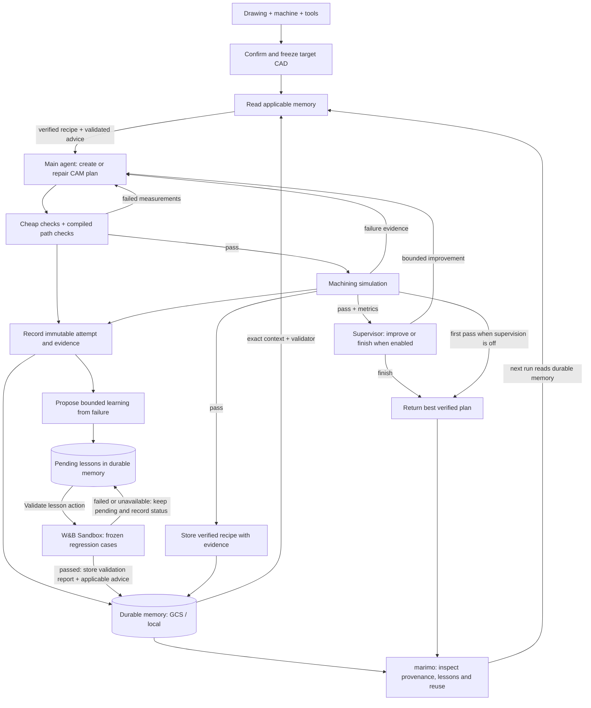

# Follow-up spec: supervised planning and validated check learning

Status: **specified, not implemented**. Created September 12, 2026.

Purpose: extend the current Silta CNC implementation to match Touko's loop diagram. Apply this after the current end-to-end path is stable, or implement the contracts alongside it if that avoids rework. Claude owns the active implementation; this document does not require interrupting that work.

References: [current product plan](../plan.md), [architecture](../architecture.md), [implementation tasks](../implementation.md), [alignment review](../touko-alignment-review.md), [required live deployment](../deployment.md).

When this follow-up is activated, its supervisor/termination and learning behavior supersede the original plan's first-success stop and developer-operated improvement cycle. Existing geometry, safety checks, sponsor requirements and live-hosting requirements remain applicable.

## 1. Outcome

The main agent creates the target CAD once from a confirmed specification, then creates or revises manufacturing plans. Cheap checks and simulation return evidence for repair. Simulation failures can produce new, independently validated early checks. Successful simulations go to a supervisor, which either requests a bounded improvement or returns the best verified plan. Accepted planning lessons persist in a versioned playbook and influence later planning calls.

This is runtime planning/policy improvement, not model-weight training. The first version generates constrained checker rules using trusted templates. Arbitrary model-written Python execution is separate scope.



## 2. Preserve these invariants

1. The confirmed design, units, material, machine capabilities, fixtures and inventory cannot change through supervisor instructions, generated rules or playbook lessons. A user edit creates a new revision and invalidates dependent results.
2. A plan is feasible only after required checks and simulation pass for its exact inputs and trajectory. Unknown, timeout or unsupported is not pass.
3. Supervisor output cannot assign authoritative correctness or performance scores, disable checks, increase budgets or approve its own proposed checker.
4. Optimization never overwrites the verified incumbent with a failed, unknown or worse candidate. If none passes, return no best plan and an explicit failure state.
5. Promoted rules cannot alter the trusted mandatory-check set or its thresholds. They add scoped early checks; successful candidates still undergo simulation.
6. All model calls, repairs, supervision and learning consume the same bounded job budget. No hidden nested retry loop.
7. Previously recorded artifacts keep their original versions/provenance. New validation creates new evidence rather than rewriting history.
8. A generic runtime supervisor is not W&B ARIA. Maintain actual ARIA experiment analysis and traceable contributions separately.

## 3. Refactor boundaries

Re-inspect the working tree before editing; filenames may have evolved. At authoring time, domain/CAD/toolpath/check/policy modules existed, while orchestration and UI were still being implemented.

| Area | Required change |
| --- | --- |
| `domain.py` | Add decision, metric, playbook, candidate-check and validation contracts; version fingerprint semantics and manifests. |
| `controller.py` or equivalent | Separate candidate evaluation, incumbent selection, supervisor decision, repair and finalization. |
| `supervisor.py` | Model-backed structured decision with deterministic bounds/enforcement. |
| `selection.py` | Pure feasibility predicate and deterministic comparison of verified candidates. |
| `policy.py` | Replace hardcoded promotion attribution with immutable policy snapshots and real evidence references. |
| `playbook.py` | Propose, validate, select and persist applicable lessons. |
| `check_learning.py` | Convert failure evidence into a bounded checker proposal; validate and publish it. |
| `checks.py` | Trusted check/template registry; evaluate a pinned active check set and report versions. |
| `planner.py` | Accept supervisor instruction plus bounded applicable playbook context. |
| `storage.py` | Durable immutable policy/lesson/validation objects and atomic activation pointers. |
| `telemetry.py` and notebooks | Trace/render decisions, promotions, rejected proposals, incumbent changes and final selection. |

Avoid a general multi-agent framework or distributed agent bus. These roles can share a provider adapter and run serially under the existing controller.

## 4. Contracts

Use the project's existing strict, versioned validation conventions. The following are new application contracts, not third-party API definitions.

### `CandidateMetrics`

- Candidate/attempt ID; spec, shop, trajectory, simulator and check-set hashes.
- `verified`: computed by trusted evaluation code, with supporting check/simulation references.
- Estimated motion time, total estimated machining time, tool changes and setups.
- Optional estimated machining cost, with declared rate/currency and estimation-model version.
- Application wall time, simulation calls and inference cost as separate metrics.
- Minimum clearance and stock residual/gouge measurements where available.

Select the objective once when the job starts: default is estimated total machining time. Cost mode requires a supplied estimation model; do not invent a shop hourly rate. Avoid counting tool/setup times twice when already included in the total. Keep feasibility as a hard gate, not a weighted penalty.

### `SupervisorDecision`

- Decision ID, input attempt IDs, incumbent ID, objective version and evidence references.
- Action: `improve` or `finish`.
- Brief user-visible explanation, proposed planning instruction, expected metric to improve.
- Stop reason when finishing: objective satisfied, no promising change, no improvement, repeated candidate, optimization limit or budget limit.
- Optional proposed playbook lesson; no direct activation privilege.

The controller rejects an `improve` decision that requires unavailable tools, altered geometry, out-of-range cutting parameters or insufficient budget. Invalid/missing supervisor output falls back to the verified incumbent and records why supervision ended.

### `PlanningLesson` / `PlanningPlaybook`

Lesson fields: stable ID/revision, instruction, explicit applicability predicate, source kind (`runtime_supervisor`, `aria`, `human`), source run/attempt/evidence IDs, validation reference, status (`proposed`, `validated`, `active`, `rejected`, `retired`).

Playbook fields: immutable version/content hash, parent version, ordered lesson references, activation scope and timestamp. Start with a team-controlled demo scope. Public visitors cannot activate team-wide policy changes. A public session may propose isolated lessons; promotion into shared defaults is an operator-controlled action.

Applicability uses structured part-family, operation, tool and fixture predicates. Do not retrieve lessons solely through unconstrained text similarity. Bound injected lessons by count/token budget and log their IDs. Mandatory instructions override lessons; contradictory lessons remain inactive.

### `CheckProposal`

- Proposal ID, parent policy/check-set version, source failure and trajectory references.
- Trusted template ID/version, bounded parameters, applicability predicate and intended failure code.
- Explanation of why the existing cheap checks missed this failure.
- Source kind/evidence and status.

Initial template family: swept non-cutting tool/fixture clearance with declared tool envelope and clearance margin. Derive applicability and parameters from the shop/trajectory, not fixture names such as “demo-case-2.” The rule must be useful on another applicable input.

### `ValidationReport` / `PolicySnapshot`

Validation report: validator version, fixture-suite hash, candidate hash, per-case expected/actual outcome, false-positive/false-negative counts, runtime, structural-check results and promotion decision.

Policy snapshot: immutable ID/hash, parent, trusted-base-check version, accepted check references, playbook version and evidence references. Keep model/prompt version separate from check-set version so comparisons identify what changed.

Do not use future or nonexistent ARIA evidence as provenance. Seed policies explicitly say `human_authored` or `fixture`; ARIA attribution requires the actual analysis reference.

## 5. Runtime state and best-plan selection

Add nonterminal `SUPERVISING`, `OPTIMIZING`, `PROPOSING_CHECK`, `VALIDATING_CHECK` and `FINALIZING` states where applicable. Individual attempt success does not immediately make the whole job terminal.

Proposed service functions:

```python
async def evaluate_candidate(context, plan) -> EvaluatedCandidate: ...
def choose_best(incumbent, candidate, objective) -> EvaluatedCandidate: ...
async def supervise(context, attempts, incumbent) -> SupervisorDecision: ...
async def propose_check(failure, policy) -> CheckProposal | None: ...
def validate_check(proposal, suite) -> ValidationReport: ...
def activate_policy(snapshot, expected_parent) -> ActivationResult: ...
async def propose_lesson(context, decision) -> PlanningLesson | None: ...
```

Algorithm:

1. Pin specification, shop, objective, model, playbook and check-set versions at job start.
2. Generate/evaluate a candidate; record all evidence.
3. On failure, produce repair feedback. Optionally propose/validate one missing check; failure of this learning branch must not prevent ordinary repair.
4. On success, update the incumbent deterministically and invoke the supervisor if budget remains.
5. If allowed, apply a bounded instruction to produce a new candidate and run all required verification again. Otherwise finalize.
6. Return incumbent ID plus selection metrics and termination reason. Candidate history remains inspectable.

Default follow-up limits: up to 3 feasibility attempts plus 1 optimization attempt, 8 total model calls, 1 missing-check proposal and 1 playbook-lesson proposal. Keep the existing 120-second job deadline; expensive calls/validation can cause optional steps to be skipped. Every supervisor/proposal/schema-repair request counts toward the global call cap. Stop validation workers at their own deadline inside the remaining job budget.

Use objective-specific numerical tolerances to prevent improvements caused only by rounding. Ties retain the incumbent unless a predeclared deterministic tie-breaker prefers fewer setups/tool changes. Feed/spindle changes must respect trusted tool/material/machine bounds before their time estimate is eligible.

For deadline/provider failure during optimization, return the already-verified incumbent with `optimization_incomplete` and the stop reason. Explicit user cancellation leaves the job cancelled but preserves any completed verified artifact for inspection; do not report the cancelled job as fully completed.

## 6. Fingerprint and lineage fix

The inspected `ProcessPlan.fingerprint` omitted feed, spindle speed, peck depth and setup assignment. The review reproduced different estimated durations with identical fingerprints. Recheck whether Claude has already fixed this before editing.

Create a canonical execution payload covering design/shop context, setup semantics, ordered operations, tool/feature associations, feed/spindle, peck depth, entry, stepdown/stepover and clearance. Exclude cosmetic plan/operation IDs and notes; normalize references so renaming IDs does not change execution identity. Unsupported setups must be rejected rather than counted as valid optimizations.

Version fingerprint semantics. Never compare old/new hash algorithms as if they were equal identities. Recorded old manifests remain readable; replay does not rewrite them. Cached verification is keyed by the execution payload plus compiler/simulator/check versions, not the model's plan ID.

## 7. Missing-check validation and activation

Validation must be deterministic and independent of the model proposing the rule:

1. Validate the template, parameters, units, applicability, time bounds and declared inputs. The template registry cannot execute arbitrary imports or code supplied by the model.
2. Confirm the new rule catches the original independently evidenced failure.
3. Test at least one distinct applicable failure, valid clearance above the boundary, the repaired passing plan, a nonintersecting traverse and an out-of-scope case.
4. Treat out-of-scope results as not applicable, not failure. Uncertain geometric envelopes warn/defer to simulation rather than claiming a proven collision.
5. Reject if known-valid cases become blocking failures, evidence is missing, the rule changes mandatory checks, or the suite times out. A finite green suite demonstrates scoped behavior, not universal correctness.
6. Save the report, immutable accepted rule and policy version before activating it.

Use a dedicated promotion-validation corpus. Keep the final product benchmark holdout outside the proposal/tuning/promotion loop so it remains a holdout.

Default activation is **next job**, avoiding hidden policy changes mid-run. A demo may explicitly adopt an accepted version at an attempt boundary: record the transition and re-evaluate every incumbent under the new check set before calling it best verified. Reuse a simulation only when the exact trajectory, simulation inputs and engine version match; add new check evidence without relabeling the old attempt. If the incumbent fails the new checks, invalidate its current eligibility and continue or report no verified result.

Activation uses compare-and-swap against the expected parent version. Conflicting proposals are not silently merged. A rejected/retired rule remains available for audit and can be rolled back by selecting an earlier immutable snapshot for new jobs.

## 8. Playbook learning

The supervisor may propose a generalizable instruction after successful or comparative evidence. Example: select sufficient cutter reach before simulating and choose a clearance that covers the swept fixture geometry. Preserve the evidence showing why that advice applies.

Validate lessons against immutable constraints and development examples before marking them active. Compare with and without the lesson under the same provider/budget. A suggested optimization that lowers feasibility or has unsupported claims remains proposed/rejected. For the first version, allow one small validated lesson; avoid unbounded self-written memory.

Persist accepted snapshots in the existing storage adapter: local files for development, durable objects for the deployed service. Keep session permissions and team-owned activation separate. Include exact lesson IDs/versions in main-agent input traces so reuse is provable.

ARIA remains a distinct measured contribution: analyze real W&B development runs, save the actual recommendation, propose a linked rule/lesson, run the same validation pipeline, then report the outcome. Runtime supervision can operate without waiting on ARIA's UI, but it must not impersonate that integration.

## 9. User-visible and telemetry changes

Add events: `supervisor_decision`, `optimization_started`, `incumbent_updated`, `check_proposed`, `check_validation_completed`, `policy_activated`, `lesson_proposed`, `playbook_updated` and `plan_selected`.

For each event store job/attempt, policy/playbook version, evidence references, sequence and timestamp. Weave records nested model/tool actions; W&B receives comparison and validation metrics. Log concise decision explanations rather than hidden chain-of-thought.

The marimo workbench shows:

- “Verified plan found” separately from “Optimization finished.”
- Supervisor instruction, attempted change, before/after objective and selected incumbent.
- Proposed check, passed/failed validation cases and activation scope/version.
- A planning lesson and the later call/case that used it.
- Stop reason and preserved valid fallback when a later attempt fails.

Exports identify the selected attempt and its verification versions. Show estimated machining cost/time separately from actual inference spend/application latency. Keep the live Cloud Run deployment requirement; a notebook-only or offline demonstration does not complete this follow-up.

## 10. Incremental migration

Implement behind `supervised_loop_enabled` and `check_learning_enabled`, initially false. Existing replay and baseline mode must remain usable for comparisons.

| Step | Work | Exit condition |
| --- | --- | --- |
| F0 | Inspect latest code; reconcile filenames and existing fixes | Record baseline commit/checkpoint and file ownership with Claude. |
| F1 | Canonical fingerprints, candidate metrics, pure selection | Relevant changes differ; cosmetic edits do not; infeasible candidates never win. |
| F2 | Supervisor contract and controller integration | Valid candidate can trigger one improvement; failed optimization preserves incumbent. |
| F3 | Versioned playbook and planner injection | An accepted scoped lesson is persisted and visible in a later call. |
| F4 | Constrained proposal/validation/promotion pipeline | Real failure proposes a check; valid/invalid cases gate activation; rejection tested. |
| F5 | Durable policy lineage, activation scope and compatibility | Restart/replay/rollback/conflicting activation preserve correct versions. |
| F6 | UI and sponsor instrumentation | Diagram's actions visible with genuine source evidence and metric changes. |
| F7 | Remote acceptance and demo | Two-case flow succeeds on deployed revision; failure paths retain honest state. |

F1–F2 can land before learning. F3–F4 use the shared policy contracts. Coordinate shared domain/controller edits; assign one writer per file. After each step, run targeted meaningful tests, review against these requirements and fix defects before proceeding. Do not combine this refactor with gears, arbitrary CAM, a frontend rewrite or model training.

## 11. Acceptance tests

Required deterministic tests:

1. A passing candidate reaches supervision rather than unconditional completion.
2. Better verified candidate replaces incumbent; worse/failed/unknown candidate does not.
3. Optimization timeout, invalid supervisor JSON and repeated plan preserve the incumbent with the correct stop reason.
4. No valid candidates yields no selected plan. Cancellation does not become a completed job.
5. Supervisor cannot change geometry, tools, fixtures, thresholds or budgets.
6. Feed/spindle/peck/setup changes affect canonical execution identity; cosmetic renaming does not.
7. All nested model calls and validation work respect total budget/deadline.
8. Generated rule catches an independent failure and accepts valid boundary cases; a false-positive or timed-out proposal is rejected.
9. Rejected proposals cannot modify base checks or active policy.
10. Policy activation is versioned, scoped and atomic; stale-parent activation fails cleanly.
11. Adopting a new check set never leaves an unvalidated incumbent labeled current-best.
12. Applicable active lessons reach planner context; irrelevant/proposed/contradictory lessons do not.
13. Restart and rollback preserve artifact access, source provenance and session isolation.
14. Missing ARIA evidence remains pending/unattributed; fixture provenance is explicit.

Required demonstration on the live app:

- **Case A:** cheap failure → repair → simulation failure → corrected verified plan → supervisor optimization → deterministic best selection. Also demonstrate a failed optimization preserving the valid fallback.
- **Case B:** different applicable input uses the accepted playbook/check; the failure family is detected before simulation. Show actual simulation counts and a nearby valid case that passes.
- Include one rejected checker proposal and its validation evidence.
- Read back Weave/W&B records and actual ARIA contribution; record release commit, deployed revision, job IDs and immutable artifact links.

## 12. Completion and handoff

This follow-up is complete only when the runtime supervisor, scoped playbook reuse and validated check-learning loop are implemented, their regression tests pass, and the remote demonstration verifies them. Do not label hardcoded v0/v1 configuration alone as generated learning.

Suggested implementation-agent prompt:

> Read docs/followups/touko-loop-refactor.md and inspect the current implementation before changing anything. Reuse completed work and preserve the live demo. Implement F0–F7 incrementally with the stated contracts, bounded loops, independent validation and best-verified-plan invariant. Keep the existing baseline/replay mode. Review and fix each step against its acceptance tests; record real sponsor and deployment evidence. Coordinate ownership before editing files another agent is writing.
