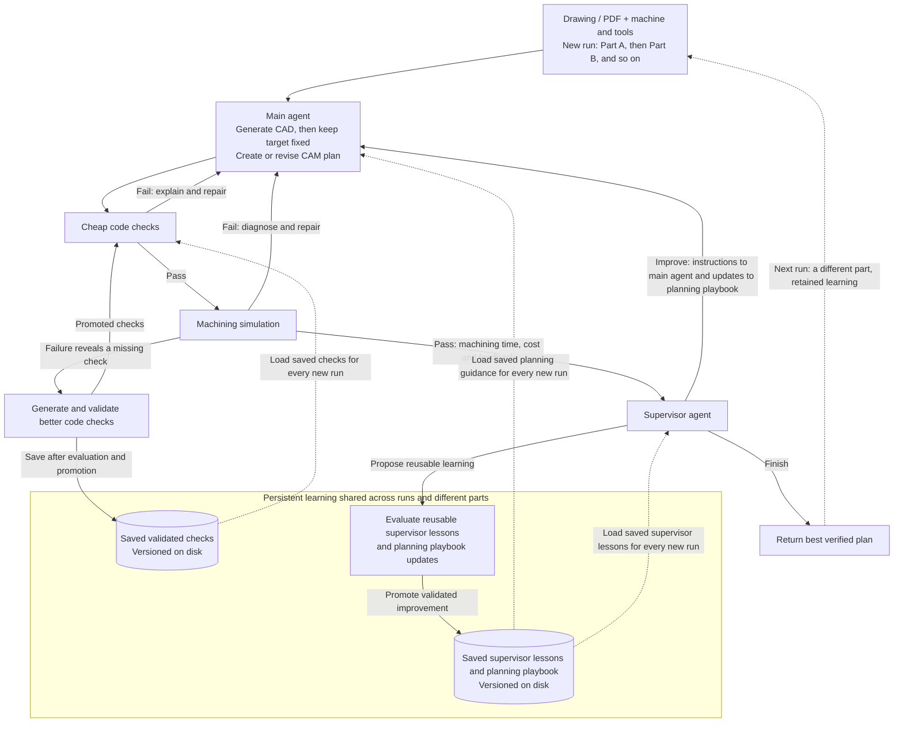

# CNC agent implementation plan

2026-09-12 · Current implementation direction; some access and integration checks remain unverified. Earlier research documents contain alternatives, not additional requirements.

**Model requirement:** use GPT-6 Astra for all agentic development and every agent/model-based judge inside the project. No weaker-model fallbacks. ARIA is the explicit exception: use its best available model when added later. Other optional model-based Signals or sponsor inference require verified Astra support. Deterministic checks and scoring do not require a model.

## Goal and loop

Drawing/PDF + machine/tool/setup inputs → accepted CAD target + CAM → cheap checks → Fusion verification → supervisor → improve CAM or return the best verified plan.

- Establish the CAD target against the drawing, then keep it fixed during CAM optimization.
- Check failures return to the main agent for repair.
- Simulation failures return for repair and can trigger proposals for better cheap checks.
- Only a completed verification pass reaches the supervisor, with machining time, cost assumptions and feedback.
- The supervisor proposes a better CAM plan or stops. Keep the best verified candidate throughout.

**Part B inherits what was learned on Part A.** Validated checks and supervisor lessons persist on disk across runs and process restarts. Each new run loads the promoted versions; checks retain their applicability conditions. Current-part repair and optimization remain inside the run. Reusable changes pass evaluation before being saved as active learning for later runs. This is the intended workflow; the complete transfer demonstration remains unverified.

## What runs where

The deliverable is an autonomous application: one job submission starts the Python controller, which calls Astra through the Codex SDK for every agent role and advances the loop itself. This development chat is not part of the runtime. Fusion remains a desktop dependency on the Mac; its API bridge and the SDK's computer-use tools are application-controlled integrations. Initial account/app consent is setup, and unavailable access is reported as an incomplete job.

| Component | Choice |
|---|---|
| Main agent, supervisor, check writer | GPT-6 Astra through local Codex SDK/app-server using ChatGPT subscription login; separate roles. Managed Agents API is a separately billed alternative, not the default. |
| Controller | One Python application on the Mac |
| CAD, CAM and simulation | Fusion professional trial on the Mac; APIs where supported, computer use for remaining UI workflows |
| Generated check execution | Separate local Python process per check run, with a clean environment and execution limits; no container/service requirement for the controlled demo |
| Traces, datasets, versions and comparisons | Weave |
| Interface | marimo, reading the same job artifacts and metrics |
| Durable state | Versioned files and a JSON job manifest |

Fusion supplies the actual manufacturing simulation and verification. A fixed
runner opens the exact candidate, invokes Simulate with Machine and Issues, waits
for explicit verification completion, and reads the results through the SDK's
direct computer-use tool call. Routine collection does not start an Astra model
turn. Astra receives the resulting feedback for machining decisions. A moving
animation or an empty issues list before verification completes is not a pass.
[Simulation](https://help.autodesk.com/view/fusion360/ENU/?contextId=MFG-REF-SIMULATION),
[issue inspection](https://help.autodesk.com/view/fusion360/ENU/?contextId=MFG-SIMULATE-MACHINE-COLLISION-DETECTION-PREVIEW).

**September 12 setup change:** W&B Sandboxes were unavailable due to the reported service bug. The user authorized replacing them. For the demo, checks run as trusted application code in a local subprocess, with copied job inputs, no inherited API credentials and a timeout. This is process separation, not security isolation: generated code can still access host files. Weave tracing, paired evaluations and promotion rules stay the same. Strong isolation is future work before accepting untrusted code.

## Evaluation before reusable changes

Current-part CAM changes repeat checks and simulation. Reusable prompt, supervisor or check changes go through a Weave evaluation before promotion; no additional always-running outer agent is needed.

- **Prompt/supervisor changes:** run old and proposed versions on the same small part set. Compare verified completion first, then machining time/cost and simulation attempts on matched successful parts.
- **Check changes:** replay frozen simulator-labeled valid/invalid candidates. Measure failures caught, false rejections and runtime; reuse labels only while candidate/setup/verifier inputs remain unchanged.
- Publish versioned results and promote only a demonstrated improvement without unacceptable regressions. Keep old versions for rollback. After an evidenced promotion, the running job adopts that exact check or prompt version for subsequent steps; record each step's versions and preserve earlier evidence. Benchmark runs retain their assigned baseline or proposed versions.
- Include simple and awkward development parts; reserve unseen parts for final assessment. Fixed target, machine constraints and scoring rules cannot be rewritten by the learner.

## First implementation milestone

1. Verify Fusion trial entitlement, subscription-backed Codex execution/computer-use integration, local check execution and one visible Weave trace.
2. Select one three-axis machine profile, cutters/holders, stock/material, fixture, tolerances and supported postprocessor. Define feed limits, tool-change time and cost/batch assumptions.
3. Automatically generate one CAM plan, invoke Fusion verification, capture completion and a deliberately introduced failure, repair it and capture a pass. Establish whether the evidence covers internal CAM motions or the exact exported NC program.
4. Add the repair loop, check learning and supervisor; then demonstrate a reusable change passing the Weave evaluation gate.

Optimize verified machining time/cost under fixed limits; include cutting, rapids and tool changes. Report estimates and assumptions. Do not reward unrestricted feed increases.

## Final result

Accepted CAD/STEP, editable CAM, exported NC/G-code, setup/tool definitions, best verified plan, verification evidence, estimated time/cost and linked Weave history. Claim only the verification coverage actually demonstrated.

If Fusion access or repeatable verification is blocked, resolve it with the team before proceeding. Do not substitute another simulator or change the agreed plan because access is missing.

## Live integration checkpoint

The SDK CAD stage has generated and independently accepted the selected soft-jaw drawing, including actual Aluminum6061 material in Fusion and STEP. The prepared vise and parallels reopened with all19 bodies intact; both enabled cutter/holder assemblies passed actual Fusion library roundtrip. The selected inputs have produced real CAM and posted NC; the fixed runner has collected completed machine verification for both a failing candidate and its repair. Full approval remains pending final stock comparison.

Autodesk requires the simulation model in a writable Fusion hub. The pinned VF-2 design is saved and fully processed in the helios hub, project **Silta CNC Hackathon**, as **Silta VF2 simulation model**. The user linked that saved design in the local machine definition's Model page. Fusion persisted its version URN, and actual API setup assignment now succeeds. Stock dimensions, G54 and Part Position offsets were applied and read back; the full machine is visible around the setup. The first loop was stopped after setup API errors so that predictable setup could move into deterministic code. That setup-only checkpoint has since been superseded by the completed verification runs below.

### Deterministic CAM preparation

The controller now activates Manufacturing, prepares exactly one owned setup and
fixture, applies the linked machine, stock, G54 (`job_workOffset=1`) and Part
Position, and provides actual approved cutter/holder objects. Astra receives
`cam`, `setup`, `target_bodies` and `tools`; it chooses operations, geometry,
strategies, order, depths, feeds, speeds and paths. Controller code finalizes the
NC program and verifies the actual bound CPS bytes while preserving chosen
cutting parameters. These changes add no agent loop.

Before asking Astra for CAM source, the controller exports a live API catalogue
of compatible strategies and the actual parameter names, expressions and choice
values for common milling/drilling operations. It creates transient inputs only,
without adding machining operations. Astra reads this catalogue to avoid guessing
API names from UI labels; the recorded defaults are not a recommended cutting plan.

Full-machine CAM archives contain external references and cannot be imported
through Fusion's local F3D importer. CAM candidates therefore also carry a
hashed `fusion_document` receipt naming an exact saved cloud version. Improvement
opens that version and completes Save As to an independent working copy before
edits; verification reopens the exact completed candidate version. The F3D export
is retained, and the accepted part-only target still opens locally. Saves are
submitted once and polled, never blindly retried after a timeout.

Live checks confirmed repeatable setup without duplicate fixtures, both approved
tools, exact NC post binding, cloud save/reopen/fork, and retained VF-2 model,
fixture, G54 and unchanged accepted geometry after reopening. The early NC wiring
probe had no generated toolpath and was not simulation evidence; the later runs
below contain generated toolpaths and actual machine verification.

### Fixed simulation collection checkpoint

The subsequent candidate generated four real toolpaths and posted NC. Fixed
`IronMachineSimulation` and `SimulationIssues` commands launched Fusion's actual
machine verification. Its accessibility summary was observed at **100%, 54
errors, 0 warnings, 0 process errors**. Reported issues included fixture/cutter,
stock/shaft and rapid-stock collisions. This is evidence of a failed candidate,
not a successful manufacturing plan. `Toolkit.cmdDialog` provides statistics but
omits the current version's detailed Issues widget; its completion/counts are
read from accessibility text instead. Offscreen issue details may be absent and
must not be represented as a complete list.

The fixed runner collected the failed candidate automatically in
`runs/soft-jaw-first-loop-v9`. Astra repaired the CAM without changing the accepted
CAD. The repaired candidate completed verification at **100%, 0 errors, 0
warnings, 0 process errors** in `runs/soft-jaw-first-loop-v10`. Fusion's API
machining estimate fell from **463.86 s to 223.11 s**. This is an estimated CAM
time, not measured physical cycle time or a full manufacturing approval.

Supported typed API readback now confirms the actual setup retains the pinned
machine's collision pairs (including intentional exclusions) and three finite
linear axis limits. The fixed runner records and validates that configuration
before simulation and checks it remains unchanged afterward. This configuration
readback is not itself a geometric verdict.

**Remaining verification gap:** automatically export the finished simulated stock
and compare it with the frozen target. The current zero-error result stays
unknown until that comparison is established. Fusion's documented canvas
**Stock → Save Stock** route exists, but automated canvas clicks currently fail;
menu controls and the fixed Issues reader work. A pointwise Stock-to-Model probe
cannot stand in for whole-part comparison. Existing unknown job results remain
unknown; later probes do not retroactively relabel them.
