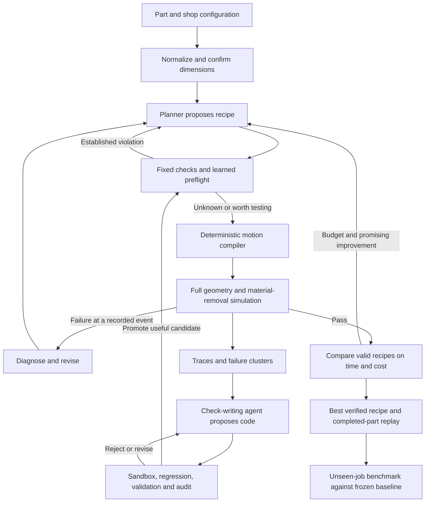

# Historical proposal: CNC planning that improves its own checks

> Superseded by [the agreed implementation plan](implementation-plan.md).
> This earlier proposal includes a custom simulator, synthetic machine and other
> choices that are not the current build. The current system uses Fusion, the
> selected Haas configuration, Astra via the Codex SDK, hosted W&B checks and
> Weave evaluation before reusable changes. Retained for research provenance.

Decision specification, September 12, 2026. Incorporates Touko's instructions, the two newest Plaud recordings and Konsta's GitHub transcript at commit `81c2cc44e011ba5d90e6f8c127f10a4731e3d7eb`. The existing `silta.loop` is still a generic starter, not this system.

## Decision and customer

**Given a part and this shop's equipment, produce a feasible machining recipe, simulate it, and learn cheap checks that make future planning more efficient.**

Build this direction. Target Best Loop and Weave, with marimo as the application and ARIA assisting experiment analysis. Model-weight training is optional. Mentor advice supports the choice but is not a judging ruling or prize guarantee. See [source assessment](../research/FINAL-SOURCE-ASSESSMENT.md).

The user is a CNC programmer/manufacturing engineer preparing incoming jobs. Demand and willingness to pay remain hypotheses. STEP is geometry, not machine instructions. The recipe is a separate structured plan containing stock, setup, tool assemblies, operations, motions, estimated time and verification evidence.

## Fixed first scope

One synthetic 3-axis vertical mill profile, pre-sized rectangular aluminum stock, vertical through holes, a finite tool library, and reviewed fixture presets. Implement one setup first. A second setup/manual flip is an extension: it needs its own supported transform and fixture, not an invented rotary machine axis.

All geometry uses mm; motion rates use mm/min. Explicit transforms connect part, fixture and machine frames. Machine profile includes axis travel, gauge-line conventions, safe retract height, tool envelopes, bed/fixture solids and timing assumptions. It is not a validated digital twin of a physical machine.

Initial synthetic limits: X −150…150 mm, Y −100…100 mm, Z −10…150 mm in the configured tool-tip frame; stock bottom Z=0, top Z=16, safe plane Z=60. A real gauge-line model must account for tool length before checking axis travel. Use a 2 mm clearance margin and separately declared kernel tolerance; neither establishes a real manufacturing tolerance. Check tool/bed clearance for the 2 mm breakthrough. The storyboard shows an X/Y moving table and a Z-moving spindle; its schematic links do not claim a specific commercial machine's exact kinematics.

| Tool | Cutting diameter | Tip-to-holder distance | Holder diameter | Purpose |
| --- | --- | --- | --- | --- |
| T1 | 4 mm | 40 mm | 18 mm | Small holes |
| T2 | 6 mm | 24 mm | 32 mm | Short assembly; possible holder-clearance conflict |
| T3 | 6 mm | 40 mm | 18 mm | Alternative assembly for the same holes |
| T4 | 8 mm | 40 mm | 20 mm | Large holes |

These are synthetic demo dimensions, not manufacturer recommendations. Add flute length, tip shape, total length, material compatibility and approved rate presets. Availability is a hard constraint: a missing tool produces an explanation, never an invented tool.

Reference job: pre-sized 100 × 70 × 16 mm plate with 4/6/8 mm holes and an edge clamp near one 6 mm hole. The short/wide holder can collide, while another available assembly clears it. First baseline failures must occur in the real planner/verifier; do not deliberately inject a mistake into a supposedly live run.

## Input and final output

Required input: supported STEP or fully dimensioned specification; material/stock; machine; available tools; permitted setups/fixtures; lot size; time/cost assumptions. Hash and preserve the submitted geometry.

Drawing/PDF path: extract typed dimensions with references to the source drawing, display them for confirmation, and generate STEP from confirmed data. Missing dimensions produce `needs_input`. A photograph cannot establish exact dimensions without a scale/reference. Start with one known drawing template; arbitrary PDF reconstruction is not on the critical path.

Output statuses: verified under modeled constraints; infeasible within the supported domain/configuration; unsupported; needs input; budget exhausted/inconclusive. Failure to find a plan is not proof of impossibility.

Successful bundle: `target.step`, editable CadQuery source when generated, `shop.json`, `plan.json`, `motions.json`, `verification.json`, `cost.json`, setup sheet, and trace/version links. Replay and verification share geometry/configuration/motion hashes. Machine-specific G-code and real-machine execution require a separate postprocessor/controller validation and are later work.

## The complete loop

| Step | Receives | Produces / decides | What we visualize |
| --- | --- | --- | --- |
| Intake | STEP/drawing/spec + shop | Confirmed geometry, units, missing data | Drawing next to target 3D part; dimension/source labels |
| Shop setup | Machine, stock, tools, fixtures | Immutable configuration | Work envelope, stock/target overlay, tool cards with reach/holder/availability |
| Propose | Job + prior diagnostics | Typed setups and ordered operations | Operation timeline; holes colored by tool; approach/retract paths |
| Cheap preflight | Candidate recipe | Violation, unknown or promising | Check cards with reason, feature, runtime and version; affected geometry highlighted |
| Full simulation | Compiled events + geometry | Stock states, first failure or pass | Moving machine axes and cutter, changing stock, collision paused in red, time scrubber |
| Repair | Exact failure + inventory | Revised candidate | Before/after tool, setup or path and a short evidence-based explanation |
| Learn | Labeled failure cluster | Check code and applicability | Plain-language rule, expandable diff, source failures and version |
| Validate | Check + separate cases | Promote, ranking-only, reject or unknown | False-rejection matrix, boundary cases, runtime and promotion decision |
| Optimize | Verified candidates | Best feasible recipe under objective | Production time/unit-cost tradeoff, tool changes and setup count |
| Deliver | Best verified recipe | Engineering bundle | Complete successful replay, finished part beside target, residual-error overlay |
| Prove transfer | Unseen jobs + frozen versions | Measured comparison | Simulations/verified job, solve rate, wall time, cost and false rejections |

A cheap rejection is shown as screened out, not a simulated crash. A simulation failure refers to an actual event. Live execution and recorded replay are labeled distinctly.

## Authoritative simulation

Use Python/CadQuery/OpenCascade for STEP and solid geometry. Restrict feature recognition to the plate-and-hole family; a cylindrical face is not automatically a supported drillable hole. Retain editable source for generated geometry. [CadQuery documentation](https://cadquery.readthedocs.io/en/latest/importexport.html).

Compile a small action vocabulary: select tool, rapid to safe plane, rapid XY, approach, drill feed, retract and explicit manual setup transition. Each event carries start/end coordinates, tool/setup IDs, rate, time interval and geometry identity. Do not execute model-generated controller code as the source of truth.

Model cutter tip/flutes, non-cutting shank and holder separately. Remove stock with solid operations and check conservative swept envelopes over the complete permitted straight moves. Rapids cannot cut stock. Verify holder/fixture/bed collisions, non-cutting contact with remaining stock, travel, depth, complete feature coverage and retained-material gouging. Sparse animation frames are insufficient. Geometry-kernel errors or unresolved tolerance boundaries return inconclusive.

Compare final remaining stock with target geometry within a declared tolerance. Start with stock already matching the outside envelope; otherwise a successful drilling sequence could leave an unmachined outside shape and falsely appear complete. Display meshes come from the same stock state and motion trace.

Passing these checks establishes modeled geometry, not force, chatter, tool wear, finish, tolerance capability or fixture strength. Use reviewed setup and rate presets. Unsupported requirements remain unsupported.

Measure simulation cost honestly. Tiny drilling scenes may already be cheap. Do not add sleeps or deliberately slow the verifier to manufacture an improvement. Include code-generation, validation and rejected-candidate audit costs in the result.

## What learns, and what stays fixed

Immutable: kernel, simulator criteria, units, schemas, fundamental machine/tool constraints, source geometry and hidden test cases.

Mutable: generated advisory checks, applicability predicates, check order, candidate ranking and retrieval lessons. Checks are pure functions over typed features with bounded time/memory and no network/filesystem access. They cannot declare final verification.

Each check returns `violation`, `unknown` or `promising`, plus reason, affected IDs and evidence. Execution failure means unknown. Mathematically supported rejection predicates may enter the blocking path once their assumptions are established. Passing finite tests alone does not prove soundness; heuristics remain ranking aids.

Promotion sequence: boundary/unit/metamorphic tests; compare against trusted simulation labels on separate validation cases; count false rejection and missed failures; measure net saved work; shadow execution; audit a sample of rejected candidates; version and rollback. Final delivered plans always receive full verification under the final shop configuration.

Example: full simulation discovers a holder/clamp collision at maximum drilling depth. The writer derives a footprint-plus-swept-Z check with explicit fixed-orientation and clamp-shape assumptions, then tests valid neighboring cases too. A new hole position/tool assembly demonstrates transfer. Memorizing a part ID is not the intended improvement.

## Optimization, cost and stopping

Feasibility is a hard gate, never traded against speed. Among feasible plans, minimize estimated production cost for the chosen lot size; expose cycle time as a second objective and show the tradeoff.

`T_cycle = cutting + rapids + tool changes + modeled dwell`

`C_unit = material + tool/consumable allowance + machine_rate × T_cycle / 60 + setup_rate × setup_minutes / (60 × lot_size)`

Rates above are per hour; times are minutes. Include manual reorientation/setup and amortize consistently. Costs are modeled assumptions, not a commercial quote. Initially estimate motion time from distance/rate and label omitted acceleration. Material/tool allowance can be fixed or unknown rather than invented precision.

Keep planning compute cost separate: inference usage, checks, simulation and learning/validation overhead. Main learning metric is full simulations per verified job at preserved solve rate. Also report end-to-end time, tokens/compute, false rejections, production estimate and learning cost. Calculate break-even jobs only if measured per-job savings are positive.

Suggested starting bounds: 12 proposals, 6 full simulations and 90 seconds per interactive job, plus an explicit monetary cap. Calibrate after timing; these are defaults, not granted quotas. Stop on budget, no promising candidate or diminishing improvement. Return the best verified plan found or an honest inconclusive/failure state.

## Fair evaluation

First make 8 hand-checked fixtures: pass, missing tool, reach, holder collision, rapid collision, out of travel, unsupported feature, infeasible supported case. Generate development/validation/final cases separated by geometry/configuration families. Disclose a small final sample if necessary (e.g. 20 jobs); no invented success rates.

Compare frozen planner + base checks, same planner + learned checks, and deterministic enumeration. Keep models, budgets, inventory and verifier equal. Separate check benefit from prompt changes in an ablation. The check writer cannot see final test failures before results are reported. Repeat stochastic trials when feasible and show denominators.

## marimo app and graphs

One marimo app with code hidden in presentation mode. Python runs the workflow. A Three.js anywidget renders the machine and compiled events; Plotly/Altair presents recorded metrics. [Custom widgets](https://docs.marimo.io/api/inputs/anywidget/), [app mode](https://docs.marimo.io/guides/apps/).

Layout: persistent part/shop/tool summary; loop progress rail; large machine viewport left; current evidence/recipe/check panel right; three headline graphs below. Tabs: Job, Machine run, Learned checks, Results. Animate locally in JavaScript, not by sending every frame through Python. Python emits stage/operation events and stock snapshots. Scrubbing is read-only. Explicit Run creates an input snapshot and unique run ID; notebook reactivity must not cause duplicate paid runs.

Three graphs: (1) simulations per verified job by version alongside solve rate; (2) planning time split into model/check/simulation/learning; (3) production time versus unit cost for valid plans. Expandable diagnostics: false-rejection matrix, setup/tool-change counts, travel, geometry residuals. Charts remain empty until actual results exist.

The [interactive storyboard](../notebooks/README.md) demonstrates presentation and illustrative machine motion only. It is not the finished agent, material-removal verifier or benchmark.

## Modules and sponsor roles

Extend the existing starter with modules under `silta/cnc/`: `schema`, `geometry`, `compile`, `simulate`, `checks/base`, `checks/generated`, `planner`, `learn`, `promote`, `metrics`. `notebooks/cnc_app.py` presents them. Synthetic cases belong in `data/fixtures/`. Local artifacts/SQLite store immutable results before rendering. No separate API service is needed initially.

Every stage emits run/job/config/version IDs, parent candidate, event, timing and result. Weave traces stages and deterministic evaluations. Signals reviews recurring failures/unsupported claims asynchronously, not as the geometry authority. ARIA analyzes actual experiment tables and proposes follow-ups; retain its contribution and verify project access. Choose a planner model through the existing configurable adapter from models actually available to the team. TypeSafe remains optional after an access/fit check.

Minimum record contracts:

- `Job`: source/target hashes, units, feature geometry/IDs, material, stock, lot size and required/unsupported constraints.
- `Shop`: version, machine limits/frames, tool assemblies, fixtures, allowed setups and rate/cost assumptions.
- `Plan`: ID, parent ID, job/shop hashes, setups, ordered operations, tool IDs and planner/check versions.
- `Motion`: plan ID, sequence, kind, start/end pose, tool/setup ID, rate preset and estimated timestamps.
- `Failure`: motion ID, type, object/feature IDs, contact/evidence geometry, tolerances and diagnostic text.
- `Result`: status, verified plan hash, simulator version, remaining-stock hash, timing, costs, trace and artifacts.
- `CheckVersion`: code hash, applicability, provenance, validation report, runtime limit, advisory/blocking state and rollback parent.

Planner and check writer are separate roles; verifier and promotion gate are deterministic functions. Snapshot versions at job start. A promoted check applies to the next job or explicit restart, never silently midway through a replay. Cache candidates only by complete geometry/configuration/plan/verifier hashes. Interrupted workers persist inconclusive status and never reuse partial success.

Store verified traces for possible future distillation. [ART](https://github.com/OpenPipe/ART) performs agent post-training; changing check code alone is not model-weight training. No training job is required for this plan.

## Build sequence and demo

1. Geometry spine: reference STEP, tool library, one compiled operation, known failure and valid completion. Check final stock versus target.
2. Visible spine: marimo machine animation driven by those events and stock states. First integration milestone.
3. Agent spine: replace text critique with structured plans and simulator feedback. One real autonomous repair plus trace.
4. Learning spine: generate one reusable check, reject an incorrect check, promote a useful one, demonstrate transfer.
5. Optimization/evidence: group tool operations, compare paths/setups, fair benchmark, assumptions and learning overhead.
6. Delivery: clean-checkout run, real replay, under-two-minute video, three-minute rehearsal and complete submission.

Allocate work areas to available teammates after the visible spine integrates; owners are not guessed. Three-minute demo: 0:00–0:25 job/shop; 0:25–1:00 real failure; 1:00–1:35 corrected machining; 1:35–2:20 learned check/new part; 2:20–2:50 measured results; 2:50–3:00 recipe download. Precomputed learning is labeled replay; keep one fresh job live.

Cut first: arbitrary PDF interpretation, arbitrary shapes, pocket milling, 5-axis behavior, invented fixtures, broad physics, CAD foundation-model training and extra UI services. If geometry validation is unreliable, narrow domain/claim; do not substitute decorative animation for verification.
