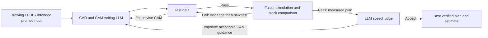

# SILTA: product, loops, demo, and agent handoff

This brief consolidates Joel's design conversation and the repository review. It preserves the final decisions after several demo revisions, rather than treating every earlier suggestion as current. Repository baseline for this update: `ddb8be6` on `toukoversion`. New user instructions and newer verified implementation evidence can supersede it.

## What we are building

SILTA helps a manufacturing shop answer: **How could we manufacture this new part with our equipment, and what would it take?**

The customer may have a drawing, PDF, or an idea expressed as a text prompt. The intended product creates CAD and CAM, verifies a machining plan in simulation, estimates machining time/cost, and improves its planning from feedback. These are new parts; there need not be an existing manufactured example or known optimal toolpath.

The current CLI accepts drawing artifacts plus structured job configuration. Text-prompt input is part of the product vision and demo, not proof of a completed prompt-only production interface. Critical dimensions, material, machine, tools, stock, fixture, tolerances, and cost assumptions must be known or clarified. Once CAD is accepted, optimization must preserve that target.

The distinctive idea is reusable learning across different parts: failures become early checks, and inefficient verified plans produce better CAM guidance. A new part should benefit from relevant earlier experience even if its geometry is different. Improvement on every individual part, or arbitrary geometry/setup transfer, is an ambition rather than a demonstrated guarantee.

## How the loops work

The simulation-to-test-gate arrow summarizes a learning step: a check writer interprets the failure, updates checks, and the CAM agent repairs the candidate. It does not mean an unchanged failing candidate is repeatedly simulated until accepted.

### Loop 1: catch failures earlier

- A fresh learning state has no learned manufacturing tests. Fixed application integrity and verification requirements still exist.
- The CAM-writing LLM creates a candidate; the test gate evaluates it before simulation.
- A test failure returns concrete feedback for a CAM revision.
- A completed simulation failure provides evidence for a new, distinct code check and a repair. Later candidates encounter the learned check first.
- The intended benefit is fewer expensive failed simulations and repeated mistakes. Passing cheap tests still requires simulation before acceptance.
- The conversation allows deterministic code checks and LLM reasoning around failures. The current persisted gate is Python; LLM reasoning generates the checks. Do not describe a separate implemented nondeterministic gate unless the code supports it.

### Loop 2: improve a valid plan

- After simulation passes, the LLM judge reviews the plan and predicted real-world machining time.
- If the judge thinks the plan can be faster, it gives the CAM-writing LLM a concrete instruction, such as reducing unnecessary travel or shortening paths while preserving clearance and required machining.
- Revised CAM returns through the test gate and simulation. A speed suggestion is a hypothesis until the revised verified result is measured.
- In the demo, every judge rejection adds exactly one new speed instruction inside the CAM-writing LLM box. This learned list starts empty. A pass does not add an instruction.
- The final design replaces vague categories such as “travel / retracts / tooling / cutting / finish / access / sequence” with readable, actionable instructions about making the part faster.
- The real runtime can replace the complete shared prompt; it is not constrained to appending exactly one item per rejection. It preserves the best verified candidate and has an attempt limit.

### Across-part learning

Both kinds of lessons persist for subsequent parts. This is the broader learning-over-time story around the two per-part loops. It is not an additional implemented agent or an update to foundation-model weights.

“Starts empty” refers to a fresh learned-test/speed-guidance state. The runtime still starts with basic CAD/CAM instructions, and the repository's `learning/` files may already contain lessons. Adding a rubric does not make an LLM deterministic; randomness is not the definition of learning.

### Loop 4: ARIA reviews the architecture

Joel explicitly named the outer development review “Loop 4.” The conversation did not specify an additional third per-part runtime loop; do not invent one to fill the numbering.

**Whole workflow and results → ARIA review → team selects changes → implementation and validation → next review.**

ARIA reviews the product assumptions, source, W&B project evidence, metrics, and Weave integration approach. It is distinct from the runtime LLM speed judge. We used it for an actual advisory review and recorded its recommendations. Continuous autonomous architecture review and automatic implementation are not deployed.

Joel's instruction in this chat was to log Loop 4 rather than add it to the standalone timeline. The separately maintained pitch deck now has an outer-review slide; preserve the distinction between pitch architecture and the per-part animation. See [the ARIA review and pitch wording](aria-loop-review.md#loop-4-aria-architecture-review).

## What is implemented, illustrated, and proposed

| Area | Status at the reviewed baseline |
| --- | --- |
| CAD/CAM generation | Astra-driven application with Fusion integration; accepted CAD target stays fixed. |
| Learned state | Two active shared files: `learning/cad_cam.md` and `learning/checks.py`. Updates apply directly and persist across jobs. |
| Verification | Fixed verifier checks its configured simulation scope and compares finished stock against the accepted target. Incomplete/unknown evidence is not a pass. |
| Check execution | Local Python subprocess with limits; not a security sandbox. |
| Weave | Application-stage traces are wired. Existing paired evaluation code is not a default prerequisite for saving shared learning. |
| ARIA | Completed source/product/evaluation review; proposed migration documented, not implemented by this chat. |
| 54-part timeline | Standalone scripted presentation artifact, independent of real Fusion runs. |
| Cross-part generalization | Product goal with repository-reported examples of reuse; no broad causal claim established by the animation or a raw cross-part average. |
| Production qualification | Simulation evidence within recorded scope; no claim of physical-machine or first-article qualification. |

Authoritative implementation entry points: [CLI](../silta/cnc/cli.py), [controller](../silta/cnc/controller.py), [learning](../silta/cnc/learning.py), [tracing](../silta/cnc/tracing.py), and [fixed verifier](../silta/cnc/fixed_verifier.py). Historical benchmark/version code being present does not mean the default runtime uses it.

## Final timeline and visual decisions

The artifact is [demo/index.html](../demo/index.html), with [run and verification instructions](../demo/README.md). The numbered moving ball represents the part being manufactured, not a model token or separate agent.

- Exactly 54 varied example inputs; controls allow 0 through 54 completed parts, play/pause, and stepping. Show different drawings and occasional short text prompts. Name the first box **Input**, not “Assembly Nest.”
- Use equal-sized boxes, restrained typography, light/neutral surfaces, clear contrast, and orange learning highlights. The reference was a minimal, spacious industrial website design.
- Make route direction unambiguous with rounded curves and arrowheads. The requested test-to-simulation connection arches above the boxes; simulation failure returns directly to the test gate. Judge feedback returns directly to the CAM-writing LLM without an oversized arc.
- The moving part marker must be opaque and travel continuously over box content between arrow ports. Connect each route through box centres, including the return from the final judge to the next Input; do not teleport the marker between corners. This connecting movement does not add an extra learning arrow.
- Keep learned tests inside the test gate. Do not reintroduce a separate test-library or judge-memory box.
- The final test display is distinct numbered rows/lines for learned tests, rather than a uniform grid implying every test is the same. The current demo illustrates eight learned tests; eight is not a product limit.
- The LLM box contains initially empty, plain-language speed instructions. Remove “70 criteria” and arbitrary counts/categories. Show new instructions when judge feedback teaches them; allow the full list to be inspected when the box cannot fit it.
- Earlier gray/orange square-grid designs were superseded by readable test rows and instructions. Do not restore them merely because they appear earlier in the conversation.
- Put the evolving charts in the same artifact, beside the loop. All y-axes start at zero.
- Latest pacing decision: use one smooth mathematical timing curve across every part and step, replacing the abrupt switch after part 2. The first parts take approximately 6.32, 3.42, 2.22, and 1.59 seconds, then continue accelerating smoothly. Total uninterrupted playback is 24 seconds, within the requested 25-second ceiling. The first two are intentionally approximate so the transition stays smooth. This is demo pacing, not evidence that real inference or Fusion execution has that speed curve.
- Failure and judge-rejection events should look irregular, with fewer later mistakes in the illustrative sequence. Avoid alternating every-other-part patterns at either the judge or gate. Shuffle input variety; do not cherry-pick part order to manufacture measured improvement.
- Keep the interface concise. Removed copy includes “Manufacturing Intelligence Live Demo,” “learned checks + verified cases,” verbose accept/save/next-input labels, generic judging-category lists, and cumulative “time saved against each part's original valid CAM.” Do not restore explanatory filler or promotional claims the presenter can explain aloud.

The provided whiteboard photograph, video reference, and website-design image informed the conversation. Their local Windows paths are not portable repo dependencies. The exported artifact and this brief carry the agreed requirements; do not assume those source media are available to another agent or that their contents have been independently re-reviewed here.

## Metrics and what they mean

| Metric | Intended interpretation | Common trap |
| --- | --- | --- |
| First simulation pass rate | More first simulations succeed as early checks improve. | This is different from the first generated CAM succeeding without any repair. Define the denominator and name the metric accordingly. |
| Simulation runs per part | Fewer simulation attempts needed to reach a verified result. | Rejecting every candidate can reduce simulation use without improving the product; show completion and false-rejection rates too. |
| Latest-20 average machining time | Mean final predicted machining time for the latest 20 completed parts; use the available completed parts before 20. | Different part complexity confounds this average. It describes workload, not causal learning. |
| New tests/instructions | Visible evidence that a feedback event created a distinct lesson. | More lessons is not automatically better quality. |

The conversation sometimes used “simulation time” to mean the physical machining duration estimated by simulation. Keep that separate from the computer wall time required to execute Fusion simulation, LLM latency, and total planning time.

The earlier desire for a logarithmic-looking improvement curve is an illustrative storytelling preference. Real results need not improve monotonically. For evidence of learning, compare frozen and updated policies on the same unseen parts, preserve failure outcomes, and repeat stochastic trials. Never reorder measured parts or change axis baselines to make results look better.

## Business review and Weave direction

The strongest use case is a new-part feasibility/planning decision under explicit machine, tool, setup, and cost constraints. A baseline can be a different plan for the same new part; it does not require an existing manufactured part.

The main design risk is promoting a lesson globally before showing it helps. One fixture-specific check can reject valid work elsewhere; one speed instruction can hurt unrelated geometries. The recommended direction is local repair first, then evaluated reusable learning, with applicability, immutable versions, and rollback.

For Weave, reuse the existing code rather than inventing a new framework:

1. Trace generation, checks, simulation, judge decisions, and learning changes with exact version and evidence references.
2. Replay old/new Python checks on frozen valid and invalid CAM examples. Measure false rejections, escaped known failures, new catches, and runtime.
3. Compare old/new prompts end-to-end on the same held-out parts. Measure verified completion, attempts, simulations, planning cost, and paired machining time/cost.
4. Use text scoring for grounded, specific judge recommendations; let the revised verified CAM determine whether the advice actually helps.
5. Keep simulator completion, geometry, and hard manufacturing constraints independent of the LLM's opinion. Count unknowns and failures explicitly.

ARIA proposed enabling the existing paired promotion path. Our review recommends first collecting useful evidence in an explicit offline/shadow evaluation, then making activation changes as a separate implementation task. This documentation update does not turn those proposals into active runtime behavior.

For economics, assess estimated manufacturing cost and planning effort against batch size and a customer cost target or selling price. Continuing optimization needs a worthwhile expected benefit. “Faster” alone is not a profitability claim. See the [full ARIA review and integration plan](aria-loop-review.md).

## Evidence and pitch handoff

[Implementation-plan checkpoints](implementation-plan.md) report measured within-part improvements, persisted lessons, and a later part reusing guidance. Those entries are chronological; early statements such as “Part B has not run” are followed by later completion reports. Do not treat each historical checkpoint as the latest status or compare unrelated part times as proof of learning.

These reports were not rerun for this context update. Before using any quantitative pitch claim, locate the matching run evidence, commit, setup, verifier scope, and measurement definition. Check for newer results. Software tests with adapters, historical recorded evaluations, the 54-part animation, and real Fusion runs are separate evidence categories.

The pitch should make the mechanism obvious: **new part → failed attempt → new check → revised CAM → speed feedback → verified plan → relevant lesson reused on another part**. Add real product footage and a real Weave trace when available. Explain ARIA with a concrete contribution, such as identifying unsafe shared-rule promotion and shaping a paired evaluation plan. Claim implementation or measured impact only when it exists.

The current deck and speaking notes are maintained separately in [demo-3min.md](demo-3min.md), [pitch_template.html](../scripts/pitch_template.html), and [build_demo_slides.py](../scripts/build_demo_slides.py). This context update does not rebuild or redesign them. Consult the current official handbook before changing submission/presentation requirements; historical notes are not a substitute for verifying current rules.

## Working priorities for another agent

1. Read this brief, then inspect the current source and task-specific evidence. Preserve the distinction between design, demo behavior, and deployed capability.
2. Make the two per-part feedback routes and persistence easy to understand. Prefer concrete examples over more boxes, labels, or agents.
3. For engineering work, identify one reproducible failure or useful lesson and connect its input, revision, version, and outcome in Weave.
4. Prove reuse on another part without claiming universal improvement. A held-out old/new comparison is stronger than an attractive curve.
5. Use the ARIA review to prioritize work, not as authority to silently replace the current runtime policy.
6. Keep the demo fast, readable, and honest. Preserve newer work by other agents when updating the branch.

## Reading map

- [README](../README.md): entry point and runtime commands.
- [Current implementation and chronological checkpoints](implementation-plan.md).
- [ARIA review, Weave proposal, and Loop 4](aria-loop-review.md).
- [Standalone timeline and presentation files](../demo/README.md).
- [Pitch notes](demo-3min.md).
- [Deferred evaluation contract](evaluation-contract.md): historical/proposed evaluation detail, not default runtime behavior.
