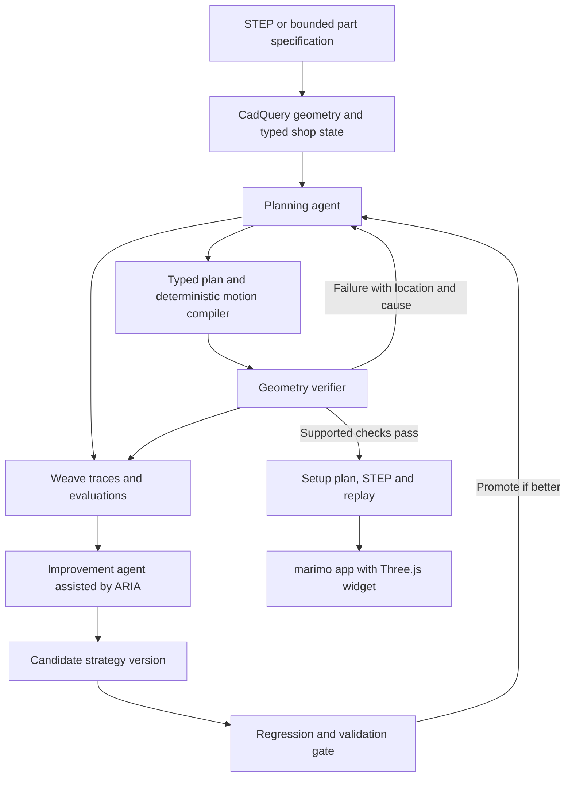

# CNC direction: decision and architecture

Earlier research. The consolidated, current specification is [the final build plan](../docs/plan.md), incorporating the newer Plaud and Konsta discussions.

Researched September 12, 2026. Proposed design, not an implemented or validated simulator. No model training has been performed.

## Decision

Proceed with a bounded machining-planning agent if the geometry verifier can be made credible quickly. Pitch: **an agent that learns how to plan parts for a particular shop, using simulation to find and correct its mistakes.**

Start with an existing STEP part and a known shop configuration. Design-to-STEP is a secondary input path for a constrained part family. The main buyer/user hypothesis is a CNC shop's programmer or manufacturing engineer preparing a job; demand and willingness to pay remain unvalidated. They need a useful setup proposal and reasons for rejection. Many incoming jobs already specify the geometry, so generating a new design is not always the relevant work.

The distinctive capability is planning and retaining useful lessons, rather than displaying collisions. Existing CAM tools already simulate toolpaths and detect stock/holder problems. See [Autodesk's collision documentation](https://www.autodesk.com/support/technical/article/caas/sfdcarticles/Rapid-collision-with-stock-while-simulating-finishing-toolpath-in-Fusion-360.html). The CAD winner suggests a valuable professional task can impress even with imperfect presentation, but its judges' private reasoning is unknown and this event explicitly emphasizes improvement loops.

## What the event actually asks for

The [participant handbook](https://wandbai.notion.site/CoreWeave-Hacks-Participant-Handbook-3c9e2f5c7ef380eab21ecdde12620caf), found in Luma announcements and read in full, requires W&B tools. Its rubric covers self-correction/improvement, meaningful agent teamwork, usefulness, technical execution, and meaningful sponsor use. No numerical weights are supplied. It does not require updating model weights. Its W&B MCP examples explicitly support improving an agent using runs, traces, and evaluations. The submission asks which RL environments/frameworks were used, but this is not an explicit requirement to perform RL.

Four complete Plaud transcripts were retrieved. These are presentation transcripts, not slide decks. The original Plaud titles include automatically generated coaching language; conclusions here use the transcript content rather than coaching summaries. All timestamps below are relative to each recording.

| Presentation | Useful evidence | Consequence |
| --- | --- | --- |
| Weave, 6:05–7:04 | Prize guidance asks for instrumented traces, evaluation examples/results, and a Signal; strongest example is finding a failure, fixing it, and showing the result | Build measurable failure discovery and improvement into the product |
| ARIA, 1:01–2:36 and 4:13–5:00 | Analyzes experiments and recommends follow-ups; presenter says usage can be assessed through ARIA conversations | Use for actual experiment analysis and retain the evidence |
| marimo, 3:56–5:55 | Puzzle demo combines a model with executable search and interactive results | Learned weights are not the only demonstrated approach; deterministic solvers are legitimate tools |
| TypeSafe | Sponsor introduced an early-access model; availability and integration need an actual access check | Optional integration after verifying interface; keep it off the critical path |

Raw transcripts and a fuller private evidence index are in ignored `.private/presentations/`. They include unreleased presentation material and are not intended for Git publication.

My classification: a technical/product hackathon centered on observable agent improvement, with explicit sponsor incentives. Training is a possible mechanism, not an established entry requirement. An agent that merely retries until success is a thinner story than one whose improvement also transfers to fresh jobs.

## Weekend scope

- One 3-axis vertical mill profile, one material, a small catalog of drill assemblies, and a few explicitly supported fixture/setup configurations.
- Rectangular plate/block parts with straight cylindrical holes. Start with through holes; blind holes add drill-tip geometry and bottom-depth handling and should come later.
- Import supported STEP solids, or generate the same part family from a typed specification. Reject unsupported features explicitly; do not imply arbitrary STEP feature recognition.
- Tool/setup selection, ordering, approach/retract motions, reach, travel limits, and collision checks. Every repositioning uses a separately reviewed setup; do not invent arbitrary clamp movements.
- Output STEP, editable source for generated parts, setup/operation plan, simulation replay, and the implemented-checks report. Machine-specific posted G-code and real cutting are outside the initial scope.

## Architecture

### Geometry and execution

Use Python with CadQuery/OCP as the authoritative geometry layer. CadQuery supports STEP import/export; STEP does not retain the original parametric history, so keep generated Python source alongside it. Use tessellated geometry only for presentation. [CadQuery documentation](https://cadquery.readthedocs.io/en/latest/importexport.html).

Represent the tool as cutting tip/flutes, non-cutting shank, and holder. Carry actual length, flute length, diameter and stickout, not just drill diameter. Normalize to millimeters and explicitly represent part-to-fixture and fixture-to-machine transforms. Version the machine/tool/fixture configuration.

The model returns a schema-validated plan with references to existing feature, tool and setup IDs. A deterministic compiler produces rapid, feed, retract and setup-change events. It must reject invalid IDs, missing operations, invalid units, and unsupported motion types. Do not run model-generated G-code as the source of truth.

For straight drilling/retract segments, check conservative swept volumes rather than sparse animation frames. Intentional cutting into stock is permitted only within the allowed removal volume. Check cutter gouging of retained material, non-cutting tool/holder versus remaining stock and fixtures, rapid moves versus stock, axis bounds and reachable depth. Maintain evolving stock or conservative stock bounds; otherwise later moves can be evaluated against the wrong geometry. Handle tolerance/contact consistently, and return inconclusive when the geometry operation fails.

Check support/fixturing assumptions through prevalidated configurations. Collision-free geometry alone does not establish clamping strength, rigidity, chip evacuation, feeds/speeds, surface finish, or real controller behavior. Label the result as passing the implemented geometric checks. A longer tool may fix reach while worsening rigidity, so it is not a universal repair.

OpenCAMLib provides useful cutter/toolpath algorithms, but is not a drop-in complete machine verifier. Narrow drilling does not justify starting with its broader surface-machining stack. [OpenCAMLib](https://github.com/aewallin/opencamlib).

### Agent roles and durable improvement

Use two meaningful agent roles: the job planner and the improvement agent. Geometry validation is ordinary deterministic software, not a third LLM pretending to certify physics.

Within a job, the planner chooses among allowed alternatives and revises using exact diagnostics. Across jobs, the improvement agent groups failed traces and proposes a versioned planning instruction, reusable retrieval lesson, or selection strategy. It cannot edit the evaluator, protected customer geometry, or acceptance thresholds. The proposal passes a fixed regression suite and a separate validation set before promotion; retain rollback.

Example: the planner repeatedly checks flute reach but neglects holder clearance. The verifier rejects a real case and Weave captures the failure. The improvement agent proposes evaluating the whole tool assembly before ranking tools. On fresh geometries the updated planner makes fewer rejected proposals while maintaining valid final plans. That improvement must be measured; it is not assumed simply because a lesson was written.

For simple finite choices, include deterministic enumeration as a baseline and use it as a tool where it is best. Do not force an LLM to rediscover straightforward collision arithmetic. Its useful work is interpreting the job, combining constraints, selecting experiments, explaining failure, and proposing a better strategy. If a small fixed solver matches the complete proposed product, the AI value proposition needs revision.

### UI and storage

Use one marimo application, with a Three.js anywidget for the workpiece, stock, holder, clamps, path and failure highlight. marimo supports custom JavaScript widgets via anywidget. Keep the geometry/verifier in ordinary importable Python modules; the notebook presents and controls them. [marimo custom widgets](https://docs.marimo.io/api/inputs/anywidget/).

Start with local files/SQLite and one bounded worker process. Store immutable job/config hashes, agent version, candidate plans, diagnostics, compiled events and final status. The renderer replays those actual events, including failures. STEP output and browser mesh must derive from the same geometry version. Add a separate API service only if multiple users/deployment actually require it.

## Natural sponsor use

| Sponsor | Actual job in the system | Scope |
| --- | --- | --- |
| W&B Inference | Hosted model for planning and improvement | Verify suitable model and quota with a minimal request |
| Weave | Trace proposals, tool calls and failures; deterministic evaluation scores; compare versions | Essential; instrumentation from the first working job |
| Weave Signals | Flag recurring patterns or unsupported claims in live traces; feed failure review | Async audit, never the sole synchronous geometry gate; verify event-account availability |
| ARIA | Analyze experiment runs and failure clusters, recommend next tested strategy | Outer loop; preserve actual conversations/reports. Not assumed to be an unrestricted low-latency runtime API |
| marimo | Interactive engineering app and experiment comparisons | Main UI, not an extra decorative notebook |
| TypeSafe | Optional constrained decision selection if interface and access suit it | Verify access and benchmark against baseline first |
| CoreWeave sandboxes | Optional isolated batch verification/evaluation workers | Use only if provisioned; local workers are adequate for initial proof |

Weave supports custom scorers and version comparisons; the official MCP server lets coding agents interact with W&B data. [Weave evaluations](https://docs.wandb.ai/weave/tutorial-eval), [online evaluations](https://wandb.ai/site/online-evaluations/), [W&B MCP](https://github.com/wandb/wandb-mcp-server), [ARIA](https://docs.wandb.ai/aria/overview). Do not claim sponsor integration until a real request/run is visible.

## Should we train a model?

Not on the critical path. Prompt, tool, memory and control-flow changes are agent improvement; call them that, not weight training. First establish a trustworthy environment, baseline, and evaluation.

W&B currently documents managed serverless SFT and RL in public preview with LoRA adapters. This makes optional post-training plausible, but does not establish this team's access, compatible model, runtime, or credit coverage. [Serverless training](https://docs.wandb.ai/serverless-training).

If the core loop already works and access/time permit, collect verified state/action/outcome trajectories. Fine-tune a small setup/tool-selection policy or train it against deterministic rewards. Require all hard constraints before optimizing secondary costs. Count unnecessary tool changes and plan cost only among valid plans; penalize falsely claiming success. Compare a frozen base model, improved prompting/retrieval, and trained policy on untouched cases. Only add training if it produces useful evidence of improvement or lower cost. Training a general CAD foundation model is far beyond the proposed weekend scope.

## Evaluation and demo

Use hand-checked fixtures plus generated variants. Include feasible cases, infeasible cases, holder collisions, insufficient reach, missing tools, out-of-travel jobs, and unsupported geometry. Separate development, promotion-validation and final test cases by geometry/configuration families; do not feed final test failures into the improvement loop before reporting results.

Report final valid-plan rate, false-success count, first-proposal validity, verifier calls per job, latency and cost. Include the base planner with the same retry budget, improved planner, and simple deterministic planner. Always report sample counts; no invented success percentages.

The three-minute story: a real shop configuration and a part; an actual rejected plan with the failure highlighted; a corrected setup/tool choice; the lesson and measured transfer to fresh parts; the downloadable engineering artifact. Keep batch experiments precomputed with provenance, while running a fresh individual job live. Prepare the required sub-two-minute recording too.

## Build order and stop conditions

1. Prove one STEP import/export and one numerically checked swept-volume collision with a matched 3D view. Include a passing case and a known failing case.
2. Add schema-driven planning and diagnostics, then trace the whole path in Weave.
3. Establish baseline/evaluation and the second, persistent improvement loop.
4. Add ARIA analysis and a real Signal-driven finding, then polish the three-minute demo.
5. Add bounded design generation or optional training only after the main evidence works.

If the first geometry proof consumes the initial implementation block without a robust result, narrow to drilling access checks or use a supported existing simulator. Do not spend the weekend writing a general CAM system. If the verifier works but the planner adds no value over enumeration, pivot the agent's responsibility toward job interpretation and constraint negotiation rather than adding artificial reasoning steps.

Outstanding: live W&B inference/Signals/ARIA access; TypeSafe interface/access; sandbox access if desired; a representative shop configuration and part source; direct organizer clarification of handbook inconsistencies. These do not change the documented absence of mandatory weight training.
